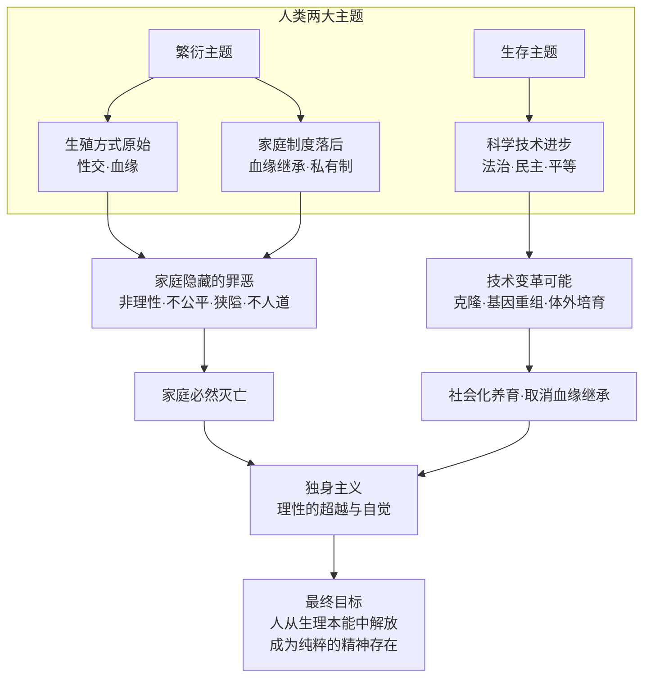
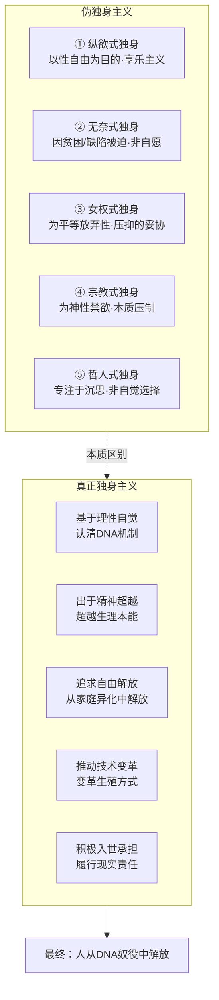
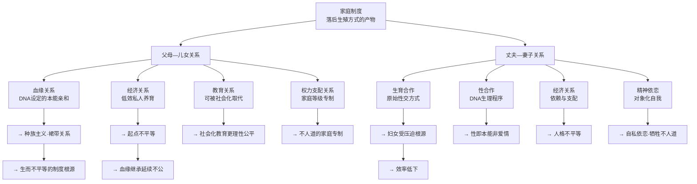
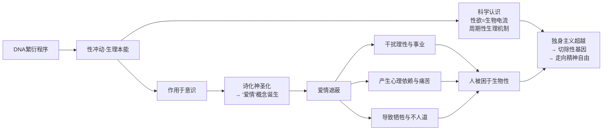

# 独身主义宣言

解散家庭!

取消血缘继承权！

解放爱情！

多么义正辞严的声音！

多么激动人心的呐喊！

这声音来自中国，来自中国西部的一个小旮旯里的一个互联网终端，然后，它将无可阻挡地向全世界扩展，成为人类身体和心灵解放的理性的福音；曾经只能在地下与角落像幽灵一样游荡的日子一去不复返了，独身主义经历了几千年苦苦追索与等待，今天终于可以走向历史舞台，向历史证明它的权利、尊严和荣耀。

历史上，家庭之外的尖锐猛烈的冲突和争斗反衬了家的可爱，掩饰了家的落后、蒙昧和不人道，人世间依然悄悄地演绎着家庭的苦难，种族主义的狂热。直到今天，迷途返来的人们才开始亮出他们的旗号---独身主义。

欢呼吧，那些在家庭重压下艰于呼吸视听的人们！

放歌吧，那些被爱情折磨得形销骨立的人们！

开怀吧。那些无家可归的孩子！

走出蒙昧，挣脱束缚，更自主、更纯粹、更自由，这就是独身主义的新生活。

生存和繁衍构成了人类的两大主题，为了生存，人类积累起科学技术，建立和革新越来越公正、自由的社会制度，人类进入工业社会、法治、民主的社会；然而，人们还没有把他们的关注的目光投向繁衍这另一个主题，这是人类至今还固守着落后的生殖方式、血缘关系及不人道的血缘继承制的原因。

当社会走向民主、和平，人际关系趋向平等与合作，当社会迈向更社会化的大生产、大融合，作为社会的“细胞”──一种误导性的说法──托庇、延续了人类的家，再也不能容纳文明人类的新生命；人们万年咏唱的爱情，也将在这个时代走向注定的休止。

同时，家庭，以其情感与习惯的、道德与责任的历史悠远的积淀，从生理到精神都还死死地抓着世人的良心，成为现代人挣不脱、不想挣的枷锁和梦魇。

生存和繁衍构成了人类的两大主题，为了生存，人类积累起科学技术，建立起趋进于公正、理性化的社会制度，人类进入工业社会、法治、民主的社会；然而，人们还没有把他们的关注的目光投向繁衍这另一个主题，这是人类至今还固守着落后的生殖方式、血缘关系及不人道的血缘继承制的原因。

历史的进步已经迫切地表现为这种新的革命：消灭家庭，不仅仅是捣毁家的外壳，还要彻底摧毁从家庭中衍生出的各种表面上美好、实质上邪恶的宗教和欺骗，使每个人由蒙昧走向自觉，由束缚走向解放。（当然，这里使用“消灭”这类暴力色彩的词语，仅仅是表达一种强烈的情感，家庭的消亡，取决于人理性的觉醒，取决于人主动的变革，取决于制度的改进和生理的技术改进，从而与历史上的暴力革命毫无共同之点。）

现实生活中已有形形色色的独身与禁欲，但并没有真正意义上的独身主义产生，其中不乏虚伪与卖弄、蒙昧与邪气，这必须与我们这里提出的超越的、理性的独身主义区别开来。

- **第一种**，有这种人，他们出于滥交的需要而提出纵欲式的所谓独身主义(以那些浪漫的所谓人文主义者、有钱有势的二世主们为主)，这种独身仅仅是不要家庭的束缚，不要家庭的伦理约束，目的是获得广泛的、更充分的性自由性满足，这当然不是真正的独身主义，真正的独身主义是为了超越性这种动物本能的束缚，达到自由的、精神的生命境界，独身主义与享乐主义是没共同点的。

当然，二十世纪西方社会掀起的性“革命”浪潮在客观上使传统家庭观念和性道德（今天的不少年轻人已开始把性生活看着一种非道德──与道德无关──的娱乐活动，他们谈性就像谈某场球赛一样无拘无束，他们过性生活就像搔痒一样随便）受到了巨大打击。

- **第二种**，由于贫困、生理缺陷而无奈地处于独身之境地。因为贫困而娶不到老婆，因为性别模糊而不知道该娶或该嫁，因为心脏病而不敢性冲动，因为丑陋或处女膜受损而无脸嫁人，这一切的独身，都是出于无奈或无知而不是出于自愿。这是很令人同情的，他们比起自愿的、基于信念而独身的人来讲，要承受巨大的痛苦、悲哀，甚至引发对不公平命运的怨恶。那些想建立家庭而不得、想性生活而不能的人，很容易造成巨大的压抑、烦恼和精神创伤，进而会产生**心理、精神分裂以至犯罪行为。

当然，也不排除某种**了的、具有某种缺陷的知识分子因此而产生独身主义思想、提倡独身的情况（可以用阿德勒的自卑情结来解释），这就是说，他们为了掩饰自己的性无能、性缺陷而假惺惺地提倡独身，就像尼采这样对女人恶言相加的人，（由于他还没有认识到性只是一种生理属性，）未尚不是出于心理**、出于酸葡萄效应，到女人那里还要带上皮鞭，这表明他这种人内心的怯懦和恐惧。

性，不过是一种生理机制，一种由DNA设定的兽性，人的理性的精神足以抵制性冲动的侵蚀；家庭，不过是一种生养后代的社会制度模式，我们完全可以用新的制度取而代之；爱情，不过是对性的迷信，理性之爱、人类友谊之爱、对人本身之爱，足以超越这狭隘、自私、本能的生理依恋。所以，独身主义不是由于缺陷或**，而是出于对生理的超越，出于进步的需要，出于精神的纯粹和心灵的自由。

- **第三种**，西方女权主义者的独身。现代女性要求平等、尊严、解放的努力是值得肯定的，但是，她们由于无视自己生理的客观条件、长期的积习形成的心理、性格条件而追求男女绝对平等，是近乎狭隘、出于自私的独身主义。在目前的条件下，为了人类的延续，女人就必须承担生孩子的义务，这对妇女确有些不公平，本来就弱小，还要负担一个婴儿日益增长的体重和营养供应，并因此遭受就业歧视以至政治权利的不平等，在性活动中，妇女也处于被动，性道德方面也不公正地、单方面地把羞耻观、贞操观加在妇女身上，这就促使女权主义者走独身道路。这就是说，她们并非不想性生活，并非不想有家庭，但因此失去了平等的人权，就只好取人权而牺牲享乐，结果，有的女权主义者禁不住性的诱惑而走向同性恋，胡罗卜成了男性的替代物。

- **第四种**，由宗教教义引出的独身行为，这是最接近理性的独身主义的一种情况，由于宗教强调精神、强调信仰，从而把性生活这样的生理本能行为看作是低贱的动物行为，甚至称之为“原罪”，佛僧则直呼“罪过、罪过”（佛教理论家没有意识到，禁欲在事实上使一些本来可以诞生的生命被谋杀在卵巢之中，从而犯下了杀生大过，当然，我们可以原谅，因为他们当时没有现代生理学知识）。按照纯粹的原旨教义，教会虔修人员都应该独身，以教会为家，以上帝或佛是爱。佛教徒或可称道；基督教则有些虚伪，那些受不了性冲击的人就把基督设想为圣父、圣母、圣灵三位一体，这样，无论男女老幼，都可以把基督作为柏拉图式的恋爱对象，中世纪的杰罗姆就称那些修女为上帝的新妇，显然，他也会把自己想象为玛利亚的情人了。

但是，即使用神圣的威严、天堂极乐的诱惑以及地狱的恐怖，禁欲主义的宗教信条也难以束缚人的欲念，广泛流传的绿鹅的故事就说明了这一点。据统计，僧侣、神职人员的寿命低于社会平均水平，这表明，禁欲使他们承受了更多的痛苦，只有少数所谓悟道之圣徒，才会从独身之中感到解脱的快乐和超凡的自由。

独身主义与宗教徒的独身，相同之处乃在于出于精神信仰，保持精神对肉体欲念的超越，不同之处在于，独身主义绝不压制生理欲望，而是由于明白了生理欲望的发生机制，通过遗忘并最终谋求利用生物技术切除生理欲望的基因，宗教徒为了上帝和死后进天堂才依依不舍性的快乐，这多少体现了当时那些先知的蒙昧的一厢情愿的空想，独身主义则是由于发现这种生理快乐的非人性而断然拒斥，是为了人的自由和出于人的自觉。
第五种，哲人的独身。在人类思想发展史上，哲学家的一个较普遍的现象是对家庭情爱的漠视，从而有很多独身的思想家：泰勒斯、德谟克利特、毕达哥拉斯、柏拉图、普诺提诺、奥古斯丁、帕斯卡尔、笛卡尔、霍布斯、洛克、斯宾诺莎、休谟、莱布尼茨、康德、爱默生、叔本华、斯宾塞、维特根斯坦......中国没有独身哲学家(庄子鼓盆而歌倒有些例外)，则可能是中国哲学衰微的一个原因。

哲人独身，有的出于对理性的虔诚，出于超越肉身的宗教信仰，有的则由于把大部分精力用于沉思而导致性冲动软弱，也有的出于贫困，出于身体病弱缺乏吸引力。总而言之，他们的独身表明人的理性的力量可以克服生理的影响，但不能表明他们是独身主义者。由于他们所处的历史时期，他们无法认识到独身的社会意义，也认识不到独身的人类可能(由基因工程──克隆和基因重组、试管培养而支撑这种可能)。

独身主义首先起源于人的自觉，自觉到家庭生活实质上是生理本能的向社会延伸，是对人的精神的一种牢笼和异化，也由于现代科学技术的进展使我们看到变革生殖方式的光明前境。家庭的产生和延续，是人类原始的生殖方式的必然。大概在原始人的群居生活的末期，由于人的个体意识的逐步形成，也产生了自私和自尊的观念，他不希望别人分享他的情人，他要维护既得利益，于是家庭应运而生；人的生殖方式与动物没有什么两样，但人认识到杂交的优势,为了避免人种的退化，那时也没有基因鉴别能力，这就需要建立血缘伦理以规范人的生殖行为，建立严格的家庭制度也顺理成章。

在私有制的社会，也只有通过家庭制度和血缘亲情维系人类的延续，这更加强化了家庭堡垒的稳固性，家庭承担了新生命的经济保障功能，试想，如果没有家庭，那些毫无生存能力的小孩子，只有去做雏妓、童工或上街乞讨。家庭制度为人类繁衍提供了这样一套模式，反过来它又成为一种桎梏，使所有的人别无选择。

人从动物进化为人，有了语言、思想和工具系统，但人的生殖方式还沿用了动物的方式，一百万年不曾动摇，这种落后的方式直到今天，直到人们认识到基因的秘密，才敲响了这种方式的历史的丧钟。

现在，就让我们来揭开家庭所包含、所隐藏的种种神话、欺骗、自私和不幸。我们可以把家庭还原为“父母--儿女”“丈夫--妻子”两个基本的结构。其它诸如祖母、外公、姨妈、侄儿、情妇之类则略而不论。

- ａ.父母与儿女这一结构包含了多种关系：
    - (1)血缘关系；
    - (2)经济关系；
    - (3)教育关系；
    - (4)权力支配关系；
    - (5)精神的同化、依附或支配关系(爱)。

血缘关系在人类蒙昧时代以及在蒙昧的人群中被看得很神圣，首先是因为血缘亲属间具有本能性的亲和力，它是ＤＮＡ设置的天然属性，这种非理性的亲和力一方面有利于血缘关系的牢固，另一方面不利于不同血缘的人与人之间的关系的平等，在人与人之间设置了血缘的鸿沟，同理性的人际关系原则也会发生冲突──在血缘亲情与公共伦理之间会发生利益的分歧，在面临这种冲突的时候，中国的孟子倾向于对血缘情感的维护，而朱熹主张大义灭亲；其次，父母结为夫妻、生出儿女，这带有很大的偶然性，仿佛有冥冥之中的天意、神恩；也由于人对人的生命得以产生的珍视、感激之情──父母是儿女的直接创生者（被神圣化的血缘关系在中国这样的血缘社会中就成了父母支配后代的强大的、精神的借口，在旧中国，因为这种关系，父母便可以对儿女生杀予夺，打死儿女是一件很合法合理的事情，那些令父母丢脸的儿女，父母就可以赐死；这种血缘关系也就演化为家庭等级关系，形成家庭制度内部的不人道性,近代以来,随着个人自由主义原则的形成,家庭对人钳制就日益削弱）。

但是，从生理学的成果来看，血缘关系只是一种自然的、生理的关系，是偶然的、非主体意志的生理机制的产物，是DNA结构下的一种本能行为，人的情感、意志不能决定精子、卵子的结合与发育，所谓爱的结晶，不过是文人在性欲的诱惑下的胡言乱语，因为**也会产生同样的结晶。某些人在追求异性时可能付出了智慧、力量、金钱等等的代价，饱受了酸甜苦辣，但归根到底，只是由于性的吸引、为了生理上的本能满足，是在ＤＮＡ驱使下的非理性行为。因此，人的生殖活动并没有什么神圣的成分。

生理学为血缘关系提供了一个冷冰冰的结论，当然，这并不妨碍人们在冷冰的事理上融入情感，赋予意义，这是因为每个人都要在现实世界或幻想世界寻找并建立某种精神的寄托，人的血缘性存在就提供了这样一种选择，但这是一种非理性的（也即非人的）选择，把灵魂寄托在生理机制上，严格地说，这是人向生物堕落。我们需要明白，人性，在严格的意义上，是不包括人所依存的生物属性的，人性首先就是对人的生物性的超越。把人的生物属性当人性，表明ＤＮＡ对人的控制力量的强大，从而人还难以抵抗和超越其生理性对人的规定和支配，这就是人的不自由的一种比政治的黑暗更久远的决定因素。

我们可以清晰地看到，迟早将要到来的无性繁殖、体外繁殖、基因重组的技术，将会把生育变成一种直接的、透明度很高的物理的方式，这就会使父母的生殖行为所笼罩着的神圣光晕消失无影，而且，没有了血缘关系，反而有了人与人之间无差别的亲密友爱的可能，人在信念上建立的亲密情感比之血缘情感要高尚得多，而且，正是血缘情感阻碍了人与人的平等友爱，产生诸如种族主义、裙带关系、人情债、人情网。

基于血缘的教育关系，它形成和存在于人类的落后时代，那时没有专业的社会化的学校教育。今天，学校教育已在很大程度上取代了家庭教育，家庭所能承担的一切有价值的教育义务和责任都可以由学校承担，并且，学校教育能更理性、更公平、更有效率地承担。相反，家庭教育在现代社会中往往扮演不光彩的角色，它的培养人的狭隘、自私(家庭观念)以至愚昧的信仰(一些邪教得以流传就是通过父母教育的功劳)。

虽不能说父母教育一无是处，那些本身有很好的教养的父母对儿女就有极良好的引导。但是，如果父母花费精力培养儿女，他们应有的作为自己本身的社会价值就相应减少了，这种顾此失彼不是一种互惠互利的行为，也不符合经济学的原则。学校教育体现了社会分工的优越性，既极大地减轻了父母的负担，也使后代的成长更理性、更公平，而且，还使父母、儿女各自获得精神上的独立自主，这是对人的一种解放。在教育模式上，人们根本不用担心社会化教育会把人变成一个模子里的机器人，社会教育的开放性、知识与环境的开放性、无限性将保障人的自主性和选择自由.

家庭经济关系就是父母为后代提供经济来源，后代又为年迈的父母提供经济保障。这种完整的互惠互利的经济关系在传统社会最为明显，在农业社会，养儿防老是人们的一个重要人生投资。到了工商业社会，个人的经济能力增强，那种相互的经济关系演变为单向的经济关系，即父母对后代成长负责，而后代对父母养老置之不理。这包含的意义是双方经济关系的削弱和由此带来的不公平，使得父母失去了养育后代的利益驱动，所以，现代西方社会发展出家庭不育现象，从而导致其人口趋减。

家庭经济关系是一种没有效率的方式，它使社会的每个人都不得不承担养育的工作，这与现代社会的专业化、分工化的特征相比就极为原始与落后。

我们并不否认，在某些家庭中，孩子成了维系夫妻关系的一种纽带，这反过来也表明，对孩子的责任就很可能成了夫妻忍受彼此不和的痛苦的原因，这种要靠另外的东西来维持的夫妻关系不是太卑贱了吗?而没有责任感的夫妻则会把儿女作为转嫁怨恨的替罪羊，不和的家庭、残缺、畸形的家庭就会给幼小的孩子产生巨大的伤害和心灵扭曲，家庭的不和、离异、父母性格上、道德上、知识上、能力上的不适于养育、教育孩子，这是客观存在的，为了孩子的幸福，就应该变革这种有很大局限性的私人养育制度。

在现代文明社会，已有不少人为了事业或个人自由放弃家庭（包括家庭生活、情爱与责任），我们从其历史性意义来讲，他们并不是出于自私，而是为了更大的社会责任，为了精神上的自由。有的人认为，家里养着一个小孩，生活就增添了乐趣，现代人不是还乐意养宠物吗?这要分情况。对那些无所事事的人，如果把时间用于养育小孩子，当然是一件大好事；但对一个有事业心的人而言，他可能更乐意于把养宠物作为工作的协调，这不比养孩子那样费心、费力，也不必有强烈的责任心，精神上、经济上投入的成本低得多，这样他就有更自由的生活。不排除有一些人就喜欢家庭生活，但少数人的癖好不应让所有的人承受，这就需要多种生养后代的制度模式，给不同的人更合意的选择机会。

家庭式的经济关系还包含更严重的社会问题。由于家庭的不同，由于父母能力、观念、经济条件的差异，以及对后代感情的不同，这造成儿童之间的命运、前途的很大差异，这些差异直接带来人与人的生而不平等，这种起点的不平等是由家庭制度特别是由血缘继承制度所产生，是显而易见的不人道（在这一点上，主张自然演化的自由秩序“原理”的哈耶克们就特别需要反思）。就目前的技术局限，我们不能改变人的生理上的参次不齐，这种生而不平等的生理的(从而影响到智力上)不平等是我们无可更改的，不属于人为的责任，但是，血缘继承制度造成的生而不平等则是由制度的落后造成的，正是血缘继承制度延续了人与人的不平等，它是使私有制成为不人道的制度的根本原因。这一点尚未有多少人认识到：私有制对单个人而言是合理的，因为人的个人能力、人生目标和人生态度、性格、偶然机遇的不可避免的差异会使不同人有不同的成就，这样，个人之间的经济收入、政治地位、社会名声就会有大大小小的差别，这种差别是合理的，值得肯定的，但这种个人之间的合理地形成的不平等通过血缘继承制度由其血缘后代继承，就造成人与人之间的生而不平等的不合理、不公正。所以，这种制度就应该被废除、被取代。

- ｂ、丈夫和妻子夫妻之间有这样几种关系：
    - (1).生育合作；
    - (2).性合作；
    - (3).经济关系(乃至支配关系)；
    - (4).精神依恋。

生育合作关系是传统家庭里夫妻间最基本、最重要的关系，这对人类的延续而言也是必不可少的。但是，由于它的历史悠久，就产生了这样一种思维定势，以为男女结合生育后代是天经地义、亘古不变，这只是一种蒙昧的看法。通过异性之间的性交繁衍后代的方法是自然演化赐予人类的，但随着人类的进步，旧有的方法就变得落后。

在传统的、动物式的生殖方式下，男女分工不同，使男女的社会关系发生戏剧性的变化。最初，妇女因生殖功能而处于支配地位，这就是母系氏族时代，女性的优越把她们固着于家庭内部，养尊处优，从事神圣而伟大的生育工作，男人反而逐步获得支配家庭的经济能力和权利，双方的地位便发生逆转，妇女沦为做家务的奴仆、生儿育女的工具、男人的附庸，并被排斥在社会生活之外。现代社会的开放使妇女走入社会生活，获得更多的人生权力和更广阔的生活空间，也产生了女性的自觉──女权主义。由于生理的分工，男女无法平等，只有改变落后的生殖方式，才有男女的完全平等，才能彻底解放妇女，并使所有的人摆脱生殖角色---DNA的规定。

旧有的生殖方式是低效率的，它使每个人都要承担生育后代的重负，可见，革新生殖方式也有经济上的意义，它使人有更多更充分的人生自由。最终，人类生产后代的方式，将根据人类的需要，以高品质、技术化的方式主动地合成，人认识了DNA的全部秘密之后，就可以自主地推动生理结构的进化和优化，甚至取代DNA的自然设计，把全部生命都纳入人的意识的牢牢掌握之中，也就可以使人完全超越生理，成为纯粹的人的存在、精神的存在。

令人遗憾的是，至今还有那么多打着尊重人权的旗号的蒙昧主义者，他们反对生殖方式的变革。

- **第一**，他们认为，人的固有的生殖方式是上帝赋予的，改变它就是亵渎神灵，是要受惩罚的。显然，这是宗教人士的观点。实质上，人主动地变革生殖方式的确是对神的权力和威信的极大损害，从而也就间接地打碎了教士、神父赖以维生的饭碗(那时肯定不需要他们去做洗礼主持了)，好在宗教已经没落，它们已无力用暴力去维护其私利和蒙昧的信条，他们已是今天的真正异端，当然，我们应宽容他们，但不能让他们的蒙昧思想蒙蔽进步的信念。
反过来，那些信仰传统宗教的人为什么又不可以认为人类的新的生殖方式正是上帝暗中默许的呢？──如果不是他的默许，人类又怎么能够掌握这种变革的能力？所以，信教的科学家们完全可以一边开发人类的新的生殖方式，一边说：感谢主，赐予我们人类新的生殖方式。新的生殖方式的变革大概会为佛教信徒所欢迎，因为，人类开始了创造生命而不是杀生。
- **第二**，人工化的生殖方式使生命的神秘性消失迨尽。但我们应指出，这种消失是一件好事，所谓神秘性，就是指人不能控制生命本身，从而是把人的命运交给不可知的外部力量，这恰恰是人的屈辱，当我们有能力按照人本身的意图进行合目的地塑造、合成后代时，我们岂能安于被支配的自然方式?
当我们揭示了生命的秘密，我们就能够趋利避害，提早改进和预防，从而使生命更完美更健康，我们难道不是经常听到人们抱怨他们的不美丽、不强壮、不聪明，以及为意想不到的疾病和死亡而黯然神伤吗？有人担心会出现遗弃残疾孩童这类不人道事情，但是，一个不人道的人遗弃他的孩子早已是古之有之，相反，如果基因工程最终能够从基因上就克服残疾和缺陷，这不就消除了不人道的可能了吗？
- **第三**，他们认为，新的生殖方式是对新的生命个体的意志和尊严的剥夺。但是，按传统的方式就是对新的生命的意志与尊严的维护吗?一方面，人的意志、灵魂，是由后天教育形成的，它注定要打上前人的烙印，所以，人们主动地设计人，是对新生命的人的赋予与塑造，而不是进行剥夺，否则，把新生儿置之荒野，那才是对他的不人道。

另一方面，新的生殖方式意味着生殖技术(传统方式则是一种落后的技术)的改进，将会消除一些先天疾病，消除生理性智力结构的缺陷，将会使人变得更完美，更强大，更有生命力。这不是对人的极大的尊重吗?

新的生殖革命是技术上的改进，它遵循人道的原则，也遵循科学理性原则，遵循技术上的循序渐进，所以并不会危及人类。传统的生殖方式则是把新生命的命运置于偶然的、大自然的力量的支配之下，使人处于蒙昧、被支配状态。

- **第四**，他们认为，新的生殖方式将会带来伦理角色的错位，将会混乱传统的血缘关系。这一点担心完全是出于传统的伦理观念，而伦理不是亘古不易的律令，它随着人际关系的变化而变化。新的生殖方式将使血缘关系不再成为一种社会关系，从而使人更平等，也会使人不再依恋于血缘情感，达到对动物属性的超越，也就更具有人性。现代社会里家庭中人不也勾心斗角，陌生的人不也可以建立同事上、信念上的亲密友谊吗?
- **第五**，那些本来就已颓废不堪的文人会说，没有了血缘关系，没有了家庭的不幸与苦难，没有了性爱的巨大魅力，艺术将何以生存?我的意见是，如果艺术是与苦难、罪孽、屈辱等相伴而生，那么，就让这种艺术与那些给人类带来不幸与痛苦的事物一道消亡吧。男人与女人之间的性合作，同样是由DNA设定的生理程序。但是，人，作为有意识的生命，它不情愿那令他们魂不守舍的性活动同野生动物们没有两样，于是乎，他们发明了美妙的辞句来纹饰这种相同性，这个词就是“爱情”。

爱情，这种专用于男女之间的情感、心理冲动，被认为是美妙的、圣洁的、崇高的人类感情。但是，人们却不知道或不想承认那是人的生理本能借人类的口在进行“自我”标傍，那些歌咏爱情的诗人，推崇爱情的哲人，那些或清纯或放荡的流行“情”歌星们，都自觉或不自觉地成了生理本能的代言人，一种由本能异化的蒙昧存在!蒙昧的人们在性欲支配下翩翩起舞，引吭高歌，缠绵凄吟，殉情而死，独身主义者对他们只有深深的同情。

所谓的爱情就是一种以性冲动为基础的情感或欲望，如今时髦起来的那种摒弃传统的经济、生殖功利的所谓纯情，完全是由性冲动、性吸引而产生的生理本能，廊桥遗梦、红高梁地野合之类的爱情故事，流溢的也不过是性的冲动，而欣赏者会情不自禁地说：多美啊，这也不过是它感染了旁观者的生理欲望而已。

每个人都体验过，一个人到了十岁左右就会萌发对异性的一种恋的心理，渴望同某个异性亲近，博异性喜欢，眼光被对方吸引弯曲，心中砰砰直跳，编织种种亲近异性的梦想。这却是性欲蠢蠢欲动而作用于意识的反应，这正是DNA的居心，它让人产生了种种想象，唤起所有理性的智慧和力量，就是企图人们用这些先进的手段来实现DNA的复制，是通过较隐蔽的方式提醒年青人该从事繁衍的工作了，这比起野生动物是要高明一点，但终究只是在形式上有更多的花招。

性冲动作为一种生理机制，在最初发作之时，并不明确地指向最后目标，而是渗透进人的意识层面，从而在人的心理－精神上产生强烈的渴求，渴求与异性结合，心中不尽的孤独、寂寞、以致心荡神摇，躁动不安，莫名其妙，这与动物的生理反应没有实质性的区别，据报道，有一头配种的公猪在发情期因没有被主人安排上班而怒火中烧，将它的主人咬成重伤，不治身亡，印度的大象发情期到来时，更是暴跳如雷，主人必须把它四肢锁固到柱上以避其祸。而猫的叫春，蝉的鸣夏，更让人不胜其扰，可见动物性冲动的力量并不逊于人类。只是由于人类长期稳定的、经常性的夫妻生活使人的性冲动周期越来越短，任何畜牲都不可以比拟(动物往往一年数次，而人，六个小时就构成一个周期)。

囊中羞涩的酒鬼路过芳香四溢的酒肆时的感受同性饥渴的感受有着相似之处，只不过前者是条件反射，后者是非条件的先天反射。正是由于性冲动不是出于理智，无以言状，人们不自觉中便把这种神秘的体验神圣化。性冲动爆发时，产生强烈的生理反应，又作用于人的意识，于是乎，春心勃动的王洛宾们便深情地歌唱“我愿是一只小鸟，跟在她身旁”，或者像诗人那样“愿意化作冰凉的雪花/在她的肌肤上溶化、溶化”。这实际上是他们内在的性欲向大脑传达了信息，又由意识诗化地传达出来，这正是DNA机制的阴险之处，也是人的不自觉之处。动物世界里也不乏千奇百怪的求爱乐曲：夜莺的婉啭，蝉的刺耳，蟋蟀的尖锐，孔雀的羽毛绝不逊色于任何怀春少女的美丽衣裙，有一种鲨鱼为了那刹那的快乐而甘愿葬身女鲨之腹，如果人的种种痴情眷恋可以称着爱情，实在不明白这种爱情比动物的性冲动高明到何处。

性欲使人的神魂颠倒，并编织种种理由和言辞来认可它，赞美它，人类伟大的灵魂在性冲动支使下翩然起舞，可怜而愚蠢。高雅到宏篇巨制、气吞环宇的诗篇，低俗到宝贝心肝，男人的种种赞美、夸耀，无尽的殷勤，最终无非是达到占有女人的肉体，把神圣、天使的女人变成其生理需要的工具，女人们往往发现在嫁给男人之后再也听不到以前的甜言蜜语。这并不是表明男人就有虚伪和欺骗的本色，而是DNA的虚伪，人本身受到生理本能的蒙骗和左右，他们种种可笑的表演，其实是身不由己、情不自禁；女人也好不到哪里，她们会用最温柔的声音，最入微的体贴，最坦诚的崇拜来勾引男人，然后你会发现她可能变成了凶猛的老虎，连苏格拉底这样不怕死的人都被女人逼到无地自容。

一切种种美好的幻想、圣洁脱俗的光晕，九百九十九朵玫瑰编成的花环，都在新婚之夜荡然无存，露出DNA的本来面目。于是，过来人感慨无限地说：婚姻是爱情的坟墓。那些尚不死心的人便又节外生枝，廊桥续梦，梦里不知欲缠身。

用科学的术语来讲，当生命体发育成熟，生理机体就会本能地释放一种生物电流，这种电流进入大脑，就产生控制力，这种电流就是性欲，它刺激相应的生理器官，其生理反应就是性渴求、性冲动，性欲在人脑控制中枢形成一个电磁场，从而周期性地主宰人的活动，并使性活动带来性快感。

食欲和性欲都是人类的两大生理需求，相比之下，食欲更经常起作用，也更为重要，但人们却重视性欲胜过食欲，这一是因为食欲产生的渴望和快感没有性欲强烈，二是因为性欲的满足依靠异性合作，不能随心所欲地乱来，需要一些媒介、催化因素，有物以稀为贵的含义，三是因为性对象是人，而食对象是人工产品，因此，性因为其对象而加重了份量。在性活动中，人与人之间往往伴随着理性的交流、合作的友情，人的尊严也渗透其中，这就使性这种低级的东西染上了人性的高贵的色彩，反过来，人的精神世界这一高贵的存在因此染上了性的低级趣味。
虽然弗洛伊德很片面地把性说成是人心灵的决定力量（弗洛伊德，《精神分析引论》），但他确实看到了性欲对人所具有的巨大作用力。如果你不是忙得没有闲暇，不是成功的禁欲主义者，那么，一旦你有了空闲，性欲就会像潮水一样时时拍击你的心扉，渗透你的心灵，令你想入非非、欲罢不能。

人们会说，这有什么不好呢?当性欲降临，我们就去恋爱，去过性生活，顺其自然，从而获得人生的乐趣甚至人生的意义。

- **第一**，性欲降临并不像朋友的不期而遇那样令人高兴，性欲带来的是失落感、孤独感，是无尽的烦恼，为了消除性饥渴的烦恼，就会产生新的烦恼，比如可能诱发**犯罪，可能使自己原来的工作热情消减，使人陷入温柔的陷阱，有的人为讨好异性而不惜贪污枉法，有的人因为性饥渴得不到满足而伤害他人或割脉自杀，或陷入精神分裂，美国总统克林顿的遭遇则已家喻户晓。
- **第二**，在我们没有性欲的时候，我们能够做到心理健康、精力充沛、信心十足，我们在自己的理想事业上愉快地工作生活。而性欲来临，就会干扰正常的生活。性欲不是出于理智，而是出于生理，从而是生理对人精神的干扰，正如我们不期而遇的白血病、癌扩散一样是对人的一种侵犯。对有事业的人而言，性欲是一种严重的骚扰，它分散人的精力，延迟人们的成功。科学研究早已证明，陷入爱情的人的理智会因此受到损害。
- **第三**，性欲带来的快感只有生理上的意义，而没有人的意义，一个追求金钱荣誉的人，他的这种快乐还可以造福于他人，从严格意义上说，纯粹的生理快感满足并不是人的行为而仅仅是畜牲行为。蒙昧的文学艺术则总是把性的意义神化。
一个人达到了性高潮，这会给他什么益处呢?仅会给他带来生理的满足和疲惫不堪以及对下一次性高潮的渴望，这样的生命形态丝毫不具有作为人的价值和意义：不体现人的创造，不体现对社会历史的推进。所以，性满足是快乐的，但快乐而蒙昧。蒙昧的人们为了这种生理的程序支配而丧失人的精神的自主、人的创造的价值和尊严。

没有了性，人类就将变得空虚了吗?没有了性吸引，人与人之间就没有亲密的感情了吗?没有了性生活，人的生活就没有了乐趣、没有了意义了吗?显然，性在人类的作为人的生活、理性的生存、追求自由的努力中是没有价值的、多余的。在历史上，性只是DNA为了生命繁衍而设立的一种自发程序，今天，人已经意识到繁衍的必要，性就已是多此一举，甚至，它以快乐为诱饵，使人丧失作为人的追求，是一种恶。它作为一种生理的力量，不依人的意志为转移，是DNA给人设置的难以反抗的暴君，需要强大的精神力量才能抗拒和超越。

即使把性生活作为人生的一种娱乐与工作辛劳的一种调剂，也可能是一种极不划算的不经济行为。比起欣赏音乐、看球赛、闲聊、散步，性生活的成本都要高出很多。
当我本人处在一种非常失意的时候，有一个年轻的（比我小11岁）女孩子主动来找我，我就放弃了永远独身的打算（我的理由有两个，一是我要偿还我对我的父母的原罪，我是它们的唯一的儿子，他们要求我为他们留下后代，而我以后就不会这样要求我自己的后代了；二是我需要通过实践了解性生活的实际内涵，需要向那些认为本人有性缺陷的人证明本人的正常），同她开始了同居，在这种同居生活中，我感觉到性生活并不是我以前想象中的那样干扰生活，而是没有性生活才对人产生了干扰，因为他们要用很多精力、时间去释放周期性的性欲能量产生的压力，比如，一个人的性幻想可能要花去一天中的3个小时，而同异性性交，只需要半个小时左右，也许还能够达到锻炼身体的作用。所以我在一个时期认为，性生活是作为精神的人不得不给生理机制交纳的税赋，禁欲则是一种得不偿失的反抗，真正有力量的反抗是从基因中切除性本能。后来，由于本人不能在经济上给她带来安全感，那个女人找到新的男朋友后离开了我，当时我感受到很大的痛苦，这种痛苦有一部分是因为想到被人抛弃的尊严的被伤害，另一部分是因为性生活产生的一种依赖性所形成的失落，这同抽烟、酗酒、吸毒、赌博产生的心理依赖感一样，经过一个星期后终于又适应了从前的的生活，性欲对人的控制力其实并不是很大，显然那些爱情在其人生信念中占据了重要地位的人，他/她失恋的痛苦就会持续更长的时间，伤害感也会更强烈。所谓的爱情不仅仅是性冲动，而且包含了人们在性合作中的友谊以及精神的寄托与依恋。

- **首先**，有所谓关于“爱”的力量的神话。有的人可以找得到一些个别的和偶然的事例来吹捧这种神话。比如爱情可以使颓废的失意者重新振作起来，爱情可以使浪子回头，使邪恶变得驯良，使愚昧变得聪明，使庸才变得大有作为。

一方面，这样的事例是极少的，而相反的例子，爱情消磨人进取的意志，使聪明人变得平庸，使具有奉献精神的人自私自利，使情欲战胜理智和法律正义，却是比比皆是。
- **另一方面**，我们不否认爱情可以在某种条件下具有化腐朽为神奇的力量。比如，爱情可以使人振作，但是，导致这种人振作的原因，却是这样一种心理法则，即：当人遭到失败，他就可能陷入痛苦、消沉之中，人怎样摆脱这种状态呢?根据心理学家费斯廷格的理论（费斯廷格，《认知心理学》），有三种方法，第一种是不相信自己已经失败，从而勇敢地重新面对生活，继续努力，这时，外在的鼓励会增加人的信心和勇气；第二种，接受失败的事实，仅把失败当作一种天意；第三种，转移目标，从而忘记失败的痛苦。当一个失意者被性爱吸引时，他就可以获得暂时的逃避，从而摆脱失败的痛苦的阴影，又可以在形成坚强的信心时重新开始奋斗。这种使人振作的情况表明用其他方式也可以达到同样的目的，比如朋友的帮助、心理医生的帮助，自我的心理调节、以及旅游、暴食都可以达到同样的效果。性爱的帮助则可能产生一些负作用，比如一个失意者常会心情烦躁，可能会把失意的痛苦甚至怒火转嫁到爱人头上，从而使对方饱受痛苦折磨；一个人为了另一个人的振作肯定要花很多精力、心血，这就使这个人为了“爱”而牺牲了自己的人生价值(如果让心理医生来从事这份工作就不存在这种牺牲，因为这是他的事业)。同样，用爱来改造罪犯、用爱来唤醒道德良知，也是风险、成本巨大的行为，如果有谁不信，他或她可以去尝试用性爱去改良那些吸毒的人、杀人恶棍吧。

当一个人所爱的人突然身染沉疴或走入邪恶之途，这个人可能会出于以前的友谊以及由性关系产生的巨大的依恋惯性而努力去帮助爱人。对这种行为，可以区别对待。第一，自己是否有这个能力帮助，否则帮助不成功，会把自己的一切都搭进去成为爱的牺牲品、爱的殉葬者；第二，成本考虑，自己为此而牺牲将有什么样的积极价值，如果爱因斯坦的妻子突然变成植物人，他为了她而放弃发现相对论，你能说他这样做合理吗?第三，如果自己付出并不会给自己带来太大的损失而能帮助爱人，当然就应该去提供帮助，这个原则适用于普通的人际关系而不仅仅是爱人之间。

关键是，这种爱情在人的价值天平上应该具有多大的分量。在理性的视野中，爱情是一种迷信，是一种此岸性的宗教变种──具有宗教的超越性幻觉和世俗的享乐意义。所以爱情在理性的人生天平上是没有分量的，最多，它只是现实中人不得不接受的的一种生理性存在内容。殉情，为爱牺牲，为爱痴狂，都是蒙昧的行为。

所以，爱的神奇力量、爱的奇迹，这不过是人们的一种幻觉或幻想，即使这样的奇迹发生，也是以更大的代价换来的，从而是不人道的，或愚昧的。

其次，相爱的人，会由于理性的作用，使性爱的情愫里包含着社会性的、理想的人生需要，他们常常把所爱看作是自我的理想化身，是自我的证实，是“对象化的自我本身”。加上性欲的巨大粘合力，使得两性双方在精神上把对方认同为自我或自我的一部分，从而使爱人之间感受到一种亲密无间、合而为一，可以为对方牺牲自己的一切(正因为这样，就有女演员为男朋友而偷税，有银行女职员为之而贪污巨额公款)，恋人们也把这视为爱的至境。弗洛姆在这方面的论述很多（弗洛姆，《爱的艺术》），可是他把人的精神皈依奠基于人的生理功能上，不能不说是一种蒙昧。

- **第一**，这样的爱的关系极难建立，它要求两个人有共同的人生信念，在个性上相互协调，有极高的道德修养(尊重、奉献)。而且，这种性爱的至境并不是只有在男女之爱中才会产生。父母与子女之间的爱、葛朗台对金钱的热爱、宗教徒对上帝的虔诚，那些具有共同信仰的革命者之间的友谊，都可以达到“忘我”的境界。但是，依靠性欲达到的人与人精神融合与因为信念达到精神的融合相比，到底哪一种真正算得上纯洁、高尚和无私呢?而且，不少家庭里的亲密感情来自于共同的生活空间、共同的生活目标与方式、共同的利益关系的认同心理，这形成的实质是友谊而不是爱情。人们所称道的爱情，实质上是揉和了友谊、信念的性渴望、性依恋，友谊是纯洁的、信念是人性的，爱情以性欲为基础，本质上属于生物属性，并非人们传颂的那样纯粹与高尚。
- **第二**，同一切爱一样，男女之爱也是自私的，在生理上，是为了性本能的得以持续实现，在精神上，爱的一方把另一方当做自我的理想化（对象化自我）或自我实现的一种工具。爱的持久就必须有条件，经济能力、性格协调、道德水平成为对双方的必要约束，这种约束就可能带来双方的或单方的某些人生自由的丧失，甚至人格的某种程度的扭曲。
- **第三**，爱人之间的“自我牺牲”，就恰恰证明了这种爱的不人道。自我牺牲意味着一定程度的自我扭曲与损失，如果受惠的一方能够坦然接受这“爱的奉献、爱的牺牲”的话，就更深刻地显示了这种“爱情主义”的不人道。正如舆论总是称颂舍己救人的牺牲者，而不是施以同情的泪水，因为施惠者伟大，而受惠者不见得伟大，愚蠢的道德观念却一直在为伟大者的毁灭而大唱赞歌，它是鼓励那些具有正义、富于自我牺牲精神的好人走上舍己爱（救）人、舍己助人的泯灭之路,当然，我们并不反对救助，但这种救助不应以牺牲某些人(特别是正直、善良的人)为代价，我们要评价这种代价值不值。既然爱情被称为是无私的，就不应该有爱的牺牲与奉献，我不希望、不接受我的所爱为我牺牲，因为我爱她，反过来她也理当不希望、不接受我对她作出牺牲，所以，至爱应该是没有牺牲与奉献，是公平的互惠互利!

男女之间只要存在着不平等的奉献与牺牲，这种爱就是不人道的或畸形的。但是，这却构成了爱情的高尚与伟大！人们热衷于赞颂为爱牺牲的无私与伟大，为什么不同样抨击那些为爱获得(受惠)的自私与渺小呢?为什么不让那些无私与伟大者减少或没有牺牲来表示我们的崇敬呢?

爱情因为牺牲而得到凸显，也因为牺牲而丧失了作为公正的道德价值。

那些称赞女人爱心博大的人恬不知耻地宣言：男人是女人的生命全部。这个原则实质上是女人在男权社会里不幸的活写真：女人不仅完全泯灭了自己，而且致力于、醉心于这种自我泯灭--一种双重的不幸。当一个人完全为另一个人而活着时，她自己就只是个影子或一种工具与玩偶；当一个人心中只想着别人时，正因为她自己太渺小、太无能，因为她没有自我，否则就简单地因为性冲动--人变成生理性存在，或因为那种使人甘于泯灭的爱情主义。从人的性生理、心理上看，人并没有从一而终的必然。相反，人都好色，如果没有伦理、法律、道德这些约束，人见了异性都会产生生理反应，所以婚外恋情合乎人之常情和人的生理原理。白头谐老式的爱情教条就是某些人的一厢情愿和不合情理的规定，这种爱情的成功常是以人受到压抑、扭曲为代价的。

为什么也有那种海枯石烂般的执着，有为爱情放弃金钱权力的人？这是因为这类人对性爱赋予了宗教性的含义，爱情在这类人那里具有最高的价值。在这种情况下,爱情是不是就很“高尚”了呢？准确地说，爱情在这种人，也只有这种人的心目中，具有至高无上的价值，这种属于他们的价值和地位并不超越他们本身而成为普遍的价值，在理性的尺度审查下，我们就可以对爱情说不。

在那些和谐美满的家庭里，爱也绝不是公平的和人道的。男人的爱常常是把女人看作是自我的一种证实，是锦上添花，男人只是在为了得到女人才说可以为对方赴汤蹈火；女人的爱更多地把爱人看作是对象化的“我本身”，把自我的人生理想和价值都托附到了对象之上，从而会表现出最无私的“奉献”。这实际上源于传统社会里女人与男人的不平等，女人被排斥在社会生活之外，她们就只好通过自己服务于男人的方式间接参与社会生活。“女人通过征服男人来征服世界”，这种冠冕堂皇掩饰了妇女被迫以自己沦为男人奴仆的方式向男人换取精神上的人的实现、一种自欺欺人的虚幻满足的真相。为什么有一些女人会死心踏地地爱上一个人呢?除了性欲的惯性作用，还有就是贞洁缘故，在世俗观念里，处女膜破坏之后的女人就已经失去童贞，这样，改嫁的女人就会背上耻辱的枷锁，虽然祥林嫂的悲剧不再重演，但在女人心中，祥林嫂式的观念未尝没有。另外，无能的女人为了经济上的保障，对新的生活的风险的畏惧也使她固守家庭。

在家庭里，夫妻之间只要存在着经济上的不平等、社会地位与个人能力的不平等，就往往会产生精神、人格的不平等。这些不平等可以由一种和谐的假面纱掩饰起来，但只是畸形的和谐，而且为了和谐必须畸形，比如，一个性无能的男人就必须容许女人出去找威猛的野男人，庄之蝶的老婆不想与他离婚就得容许他拈花惹草，而一个没钱的男人在家中就只好听凭河东狮吼。这种经济、肉体、精神的互补式的爱情，它产生于人与人的不平等，显示了家庭脉脉温情掩饰下的人性的泯灭：自己没有社会角逐的机会或能力，就只好在精神上把爱人的成就当成自己的成就；自己没有创造能力，就只有依靠自己的肉体，自己的低级服务来向异性换取自己的人生理想的虚幻满足。在今天，同样有卑微的男人走入厨房，无奈地沉沦在倾斜的爱情里，苟且偷生。如果男人与女人在家庭中经济平等、精神人格平等，也就不存在谁服务谁、谁依赖谁的问题，各自有独立的精神世界、独立的属于自己的人生价值。这样，夫妻之间就只是生育合作与性合作的伙伴。生育合作只存在于落后的生殖方式之中，在未来社会，新的生殖方式取代了夫妻生育，这时，夫妻就只是纯性友，与酒友、棋友几可同日而语，夫妻关系就只是性合作关系，是以一种友谊取代了昔日荣光的“爱情”。

在新的历史条件下，什么贞操、什么乱伦、什么海誓山盟，都成了可笑的、过时的道德枷锁，出于人们的个性化、自由化的追求品味，人类不再用法律和道德来约束(仅用医学的、生理的原理来规范纵欲、防止性病传播)两个人的性行为，就像法律不限制人们抽什么牌子的香烟一样，也不会限制人们对性伙伴的选择与变更的自由。卖淫可能成为一种时髦艺术，在重大的人类节日做开幕式压轴表演。这样，肯定有专业和业余的妓和伎，往日被禁的黄色书刊、音像也将堂而皇之地执娱乐界牛耳，像《金瓶梅》、《废都》里被删去的内容，则成为埋藏久远的陈坛佳酿、灿烂的艺术瑰宝，它们的作者，则被尊为性艺术之父，“光荣而崇高”。

到这时候，人类千百年依存的家庭便彻底瓦解，人类后代在实验室里产生，水晶玻璃管里发育，在学校里被塑造成人，平等地进入社会，自由地生存发展。

独身主义，正是从人对公平和自由的渴求，对家庭必然灭亡的历史趋势的深刻认识基础上，必然地产生。把独身主义视作灭绝人种的祸根，是因为对科技发展足以变革落后的生殖方式的伟大前景的无知；那些顽固地认为独身主义是**性、性缺陷、性嫉妒**的产物的人，本身不过在炫耀其性优越的浅薄与低俗；那些认为没有了性、没有了性爱，人生就失去了意义的人，其本身不过是寄生性本能上、缺失了人的自主和精神自由的可怜虫；那些认为没有了家庭、没有了家庭关爱的孩童的命运一定悲惨的看法，不过是看不到人类集体之亲爱、技术之力量的鼠目寸光。

独身主义揭示了家庭隐藏的罪恶和它的必然灭亡，但并不倡导走出家庭的性泛滥。在中国，先富起来的人越来越多，新兴的性活动已成燎原之势。有钱有权的人可以包二奶包三奶，那些觉悟了的性打工妹也会傍二爷、傍三爷，她们使生理资源得到充分开发与利用，这就产生了一种交叉的、网络的性产业，实际上就是“有中国特色的”的性互联网，这个互联网在市场体制之下自发地产生，不需要任何成本，比起比尔×盖茨的互联网不知要高明多少。现在这种网络通过诸如金苹果娱乐场、导游公司这样一些中介日益渗透到大学、中学，为二十一世纪的中国构造了一个鲜明的“中国特色”。然而，这一切都与独身主义无关。

独身主义认为，性，本身是一种生理机制，它本来的功能是推动繁衍，当生殖方式得到改进而不需要性欲助产生时，性欲就可有可无，如果不去强化它，它就会像猿人的尾巴一样自然退化直到消失。考虑到性欲是一种本能力量来规范、引导人的行为，从而导致人被诱入生理态，人的精神被本能所异化，出于人的自觉，为了人的超越的精神需要，独身主义主张在新的生殖方式成熟的时期将性结构从基因中切除（当然，为了使某些百无聊赖者不会因此感到遗憾，可以保留性基因而只是给它加上一个可以由人自己的意志自主控制的程序开关，这样失恋者就可以通过关闭它而消除痛苦、社会角逐种的失意者可以打开性的开关而忘掉烦恼）。

人的进化历史，实际上就是不断超越束缚的历史，超越地域的束缚，超越环境条件的束缚，超越蒙昧、超越野蛮，最终是完全超越生理，从而人走向自由。

在现实的今天，我们还不得不通过性交、子宫孕育、家庭养育的方式生产后代，我们也还不能切除性欲。在这样的历史条件下。独身主义有什么作为呢?

- **第一**，独身主义者将承担作为人的现实责任，包括生育、养育和教育后代的责任。独身主义者不是看破红尘、逃离社会的遁世者，不是不负责任无所事事的犬儒主义者，相反，独身主义者有积极、进取的人生态度，强调人的平等的社会性，强调人对历史的责任。所以，为了人类的延续和更好的延续，独身主义者绝不逃避生产后代的责任。
- **第二**，独身主义者强烈地要求改进生育方式和养育方式。即主张推动克隆、基因重组、试管婴儿、体外孕育的新的生殖方式，以及建立社会化的公平的养育制度，从而取代家庭养育制度。这有助于科技进步和社会改良。
- **第三**，独身主义有助于人本身生产的社会化、分工化，从而更有效率、更公平和更理性。
- **第四**，独身主义将使人摆脱生理性的本能支配，使人成为精神的人，超越的人，从而获得更多的心灵自由。
- **第五**，独身主义将使更多的人关注家庭内的苦难，从而寻找革新的途径。
- **第六**，独身主义可以使家庭中人以超然心态来看待家庭关系，从而可避免许多的纷争和伤痛。

独身主义的最终意义在于破除人们对家庭、对爱的迷信。给人类指出获得自由的全新途径：建立公平的社会化的教养后代的专业化机构，从而取消血缘继承制度，从根本上消除私有制的不人道和本能性的自私观念；同时推动无性繁殖、体外培育的新技术的发展，彻底变革生殖方式，彻底解放妇女，独身主义的理想将解放夫妻、父母、儿女及“悲惨”卖淫的妓女，把所有的人从生殖状态、生殖功能、生殖功利里解放出来。

弗洛姆曾说爱使两个人变成一个人；现在，独身主义的使命就在于使被“爱”变成半个的、残缺不全的人成为独立、完整的自由存在。所以，独身主义必将推动人类的全面解放，简直算得上这个混乱不堪、是非颠倒的人世间的救世福音。

我们也不妨来它个口号：全世界独身主义者，联合起来!
