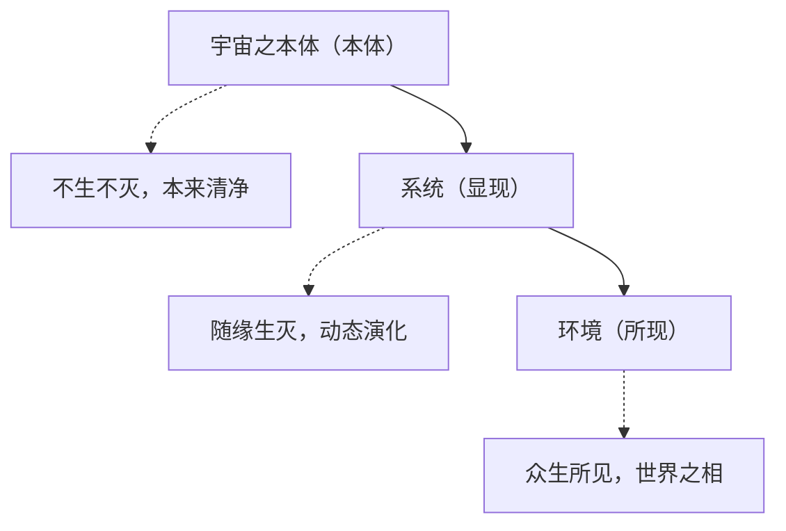

# 发展存在论——论发展存在之本、机、律与极

## 绪论：发展存在之问

### 一、起手之论

**何为发展存在？**

由各级生命之际观之，个体生命构建整体生命之过程也；由单级生命内观之，谓自觉设计自主构建更高级生命之具体过程也。

是故，发展表现为存在，存在依发展而存在，发展实现了存在之迭代，存在为新发展之基础。若发展停滞，则存在必将湮灭。

此起手之论，乃发展存在论之纲领也。今将以此为起点，层层展开，论述发展存在之本、发展存在之机、发展存在之律、发展存在之极。

### 二、发展之问题的提出

汝可观万物：原子结合为分子，分子聚而为细胞，细胞构而成形体，形体聚而为种族，种族栖于星球，星球环于星系，星系组为星云，星云终归宇宙。

然，此递进之过程，其动力何在？其规律为何？低一级之生命，何以能构建高一级之生命？高一级之生命，又如何反馈低一级之生命？

且夫人类孜孜于科技、道德、灵性之发展，其终极所向，究竟何方？发展是否有止境？抑或发展本身即是生命之本质、发展即是存在之全部？

此皆发展存在之问也，非科学家所能独答，非哲学家所能偏释。必也以悟学之方法论——身心体悟、极限思维、统摄会通、逼近真理——穷究发展存在之极限，方能得发展存在之本真焉。

### 三、悟学方法论之引入

[00-悟学概纲](00-悟学概纲.md)论悟学核心命题曰：**通过身心体悟，对所有学问求极限，不断逼近真理。**

悟学有四要焉，运用于发展存在论：

其一，**身心体悟**：非徒以理智分析，乃以身心实证发展之真实。发展非外在观察可得，乃内在体认方知。

其二，**极限思维**：超越具体之发展现象，求其最一般之本质。发展之极限，即自觉意识与存在完全合一之处。

其三，**统摄会通**：将分散之发展观念统摄为一完整理论。发展与存在非二，乃一体两面也。

其四，**逼近真理**：不断精进，渐次接近发展存在之终极真相。

[03-广义生命论](03-广义生命论.md)云：**生命者，以整体自觉意识为核心，在一定内外条件下自主维护低熵态及内外边界，且能通过层级递进不断超越自身局限的有灵体系也。**

将此原理运用于发展存在观，则见：**发展者，生命之本质属性也**。生命之所以能超越自身局限，正赖发展之力；生命之所以能从低层级向高层级演进，正因发展之机。发展是生命之本能，亦是存在之必然。

---

## 第一编 发展存在之本

### 第一章 发展存在的定义与本质

#### 第一节 发展的定义

**发展者，生命自觉设计、自主构建更高级存在形态之过程也。**

此定义有三要义：

其一，**自觉设计**：发展非盲目之演进，乃有意识之规划。非徒然被动适应，更能主动塑造未来。

其二，**自主构建**：发展非外在强加，乃内在驱动也。生命自身即是发展之主体，发展之动力源于生命之内在矛盾与超越诉求。

其三，**更高级存在形态**：发展有方向焉，由低而高，由简而繁，由被动而主动，由自在而自为。

#### 第二节 发展与存在之辩证

由起手之论观之，发展与存在有五重辩证关系焉。今逐一论证之。

**第一重：发展表现为存在**

[03-广义生命论](03-广义生命论.md)论一切存在皆为生命。而今更进一解曰：**一切存在，皆发展之表现也**。

岩石有岩石之发展——其风化侵蚀、板块运动，皆其"发展"之过程也；山川有山川之发展——其隆起沉降、水土流失，皆其"发展"之痕迹也；河海有河海之发展——其流向低处、潮汐涨落，皆其"发展"之作为也；日月星辰有日月星辰之发展——其旋转运行、核聚变燃烧、生死轮回，皆其"发展"之使命也。

是故，**存在即发展之迹，发展即存在之机**。无发展则存在僵化，无存在则发展无所依。二者相即相成，不可分割。

**第二重：存在依发展而存在**

宇宙间一切存在，皆非一成不变，乃时时在发展中也。

原子若不发展，则不能维持其存在——核外电子若不运动，原子即成死物；分子若不发展，则不能形成新物质——化学键若不重组，分子即成僵体；细胞若不发展，则不能维持生命——新陈代谢若停止，细胞即趋死亡；形体若不发展，则不能进化——若停止进化，适者生存之法则必将其淘汰。

是故，**存在之维持，本身即是发展**。存在非静态之永恒，乃动态之平衡；存在非被动之存续，乃主动之发展。维持即是发展，发展即是维持，二而一也。

**第三重：发展实现了存在之迭代**

发展非徒然变化，乃存在之更新换代也。

[03-广义生命论](03-广义生命论.md)论层级递进：每一层级之生命，于其下级而言是整体，于其上级而言是个体。原子于电子与核是整体，于分子是个体；分子于原子是整体，于细胞是个体；细胞于分子是整体，于形体是个体。

每一层级之发展，皆包含两层意义：**一则对本层级之维持，二则对上一层级之构建**。原子发展，既维持原子之存在，又为分子之诞生创造条件；分子发展，既维持分子之存在，又为细胞之出现奠定基础。

是故，**发展是存在之迭代，而非存在之替代**。低级存在不因高级存在之出现而消亡，乃成为高级存在之组成部分。新发展建立在旧存在之上，旧存在通过发展而获得新意义。

**第四重：存在为新发展之基础**

发展非凭空出现，乃建立在已有存在之基础上也。

[03-广义生命论](03-广义生命论.md)论涌现性之原理：每一层级，皆涌现出低层级所无之新性质。然此新性质非凭空产生，乃从低层级之基础上涌现而出。分子涌现于原子，非原子消灭而分子生，乃原子组合而分子出；细胞涌现于分子，非分子消灭而细胞生，乃分子组织而细胞成。

是故，**一切发展皆有根基，一切创新皆有所承**。发展不是否定旧存在，乃是继承旧存在并超越之。存在为新发展之基础，发展为存在开辟新路。

**第五重：发展停滞则存在湮灭**

此命题乃发展存在论最核心之洞见也。

若发展停滞，则低熵态不能维持——热力学第二定律必使系统趋于最大熵，即无序混乱之状态；若发展停滞，则内外边界不能维持——生命与环境之物质、能量、信息交换中断，边界必然崩解；若发展停滞，则层级递进不能实现——系统将困于某一层级，不能超越自身之局限。

宇宙间一切存在，皆靠发展而存续。**发展是存在之必需，非存在之奢侈**。当发展停止，存在即失去其意义；存在失去意义，即趋向消亡。此非外部强加之法则，乃内在必然之规律也。

#### 第三节 发展存在的本质

**本质一：发展是生命之本能**

[02-人正论](02-人正论.md)论自觉意识有三重境界：知觉、觉察、觉悟。而发展之本质，正与自觉意识之三重境界相呼应。

知觉境界：生命感知自身存在，感知环境变化，此为发展之起点——知有我，知有境，知我与环境之关系；

觉察境界：生命反省自身，审视己之状态，此为发展之动力——觉察不足，觉察矛盾，觉察超越之可能；

觉悟境界：生命悟己之使命、担当、归处，此为发展之方向——知从何来、往何去，知发展之终极意义。

是故，**发展内嵌于自觉意识之中**，发展是自觉意识之实践形式。有自觉意识者，必求发展；无自觉意识者，其发展亦不自觉耳。

**本质二：发展是存在之实现方式**

存在非空洞之"有"，乃通过发展而不断实现其可能性也。

[03-广义生命论](03-广义生命论.md)论生命之定义有五要义，今以发展存在观释之：

其一，整体自觉意识——发展之主体也。唯有具备自觉意识者，方能为发展之主体，方能自觉设计、自主构建。

其二，自主维护低熵态——发展之目标也。发展即是为了维持低熵、抵抗热力学第二定律之分解作用。

其三，内外边界之确立——发展之范围也。生命通过与环境之物质、能量、信息交换而发展，边界即发展之舞台。

其四，层级递进——发展之路途也。从低级向高级，从简单向复杂，从被动向主动，此发展之方向也。

其五，有灵体系——发展之载体也。唯有具灵性之存在，方能承载发展之过程，方能使发展得以实现。

**本质三：发展是自觉意识的扩张**

[02-人正论](02-人正论.md)论人之本质为整体自觉意识。今以发展存在观论之，则见：**自觉意识之扩张，即发展之本质也**。

原子之知觉，为自觉意识之初始——原子知其存在、知其与别之关系，此发展之初阶也；分子之知觉增强、觉察初萌——分子能"识别"底物、能选择反应，此发展之中阶也；细胞之觉察显现——细胞能主动趋利避害，此发展之大阶也；形体之自觉增强——形体能认知自我、作出选择，此发展之进阶也。

而自觉意识不止于此。人类之上，尚有种族之自觉、星系之自觉、星云之自觉、宇宙之自觉——自觉意识高于人类者，亦复不少。**自觉意识之不断扩张，即发展之最高表现也**。

---

## 第二编 发展存在之机

### 第一章 发展存在的动力机制

#### 第一节 内在矛盾：发展之原动力

发展之动力，源于生命内在之矛盾也。

[03-广义生命论](03-广义生命论.md)论生命之定义：生命以整体自觉意识为核心，自主维护低熵态及内外边界。然此低熵态与高熵环境之间，存在着不可克服之矛盾；此内外边界之内与外，存在着永恒之张力。

**矛盾即发展之母**。生命为解决此矛盾，不得不发展；发展为解决此矛盾，不得不超越本层级之局限。每一次发展，都是对内在矛盾之回应；每一层级之递进，都是对内在矛盾之扬弃。

此内在矛盾有三：

其一，**有限与无限之矛盾**——个体生命有限，而追求之目标无限；发展空间有限，而发展之可能性无限。

其二，**秩序与混乱之矛盾**——生命追求低熵有序，而环境趋向高熵无序；内部秩序需要维持，而外部混乱不断侵蚀。

其三，**个体与整体之矛盾**——生命既是个体，又是整体；既需维护个体之利益，又需服务于整体之发展。

#### 第二节 降熵驱动：发展之热力学机制

薛定谔云："生命以负熵为食。"而发展，即是降熵之过程也。

[03-广义生命论](03-广义生命论.md)定义生命熵与自觉熵，论及熵减速率。今以发展观释之：发展即熵减之实践形式。每一次发展，都是系统熵值之降低；每上一层级，都是系统有序度之提升。

**发展是逆热力学第二定律而行之力**。宇宙整体趋向最大熵（热寂），而生命通过发展，在局部创造秩序、维持低熵。此逆流而上之势，即发展之伟力也。

然发展并非消除熵增，乃在熵增之大趋势中，开辟局部之低熵空间；发展并非违背热力学第二定律，乃在此定律之框架内，实现生命之存续与超越。

#### 第三节 自觉设计：发展之意识机制

[02-人正论](02-人正论.md)论自觉意识三重境界。今以发展观论之，则见：

**知觉阶段**：发展以本能驱动为主，生命不自觉其为发展，但发展已然发生——如原子之振动、分子之运动、细胞之代谢。

**觉察阶段**：发展以目标驱动为主，生命觉察自身之不足、觉察环境之变化，开始有意识地进行调整——如细胞主动趋利避害、形体主动适应环境。

**觉悟阶段**：发展以使命驱动为主，生命觉悟己之使命、自觉设计发展路径、主动构建更高级存在——如形体生命发展能力、文化传承、追求发展。

**自觉程度越高，发展之主动性越强**。不自觉的发展是本能的发展，自觉的发展是自由的发展。唯有达于觉悟阶段，生命方能真正成为发展之主人，而非发展之奴隶。

### 第二章 发展存在的层级机制

#### 第一节 自组织与他组织

[03-广义生命论](03-广义生命论.md)论层级递进之机制：有自组织与他组织二种。

**自组织**：系统内部相互作用，自发形成有序结构。分子自动组装为细胞，细胞自动分化为组织，形体自动发育为完整个体——此皆自组织之例也。自组织之发展，乃由内而外、由下而上之发展。

**他组织**：外在力量使无序变为有序。人类塑造形体级生命，文明塑造种族级生命，造物主塑造星系级生命——此皆他组织之例也。他组织之发展，乃由外而内、由上而下之发展。

自组织与他组织，非截然对立，乃相辅相成也。**自组织为他组织提供基础，他组织为自组织提供引导**。无自组织，则他组织无所施其力；无他组织，则自组织不能超越本层级之局限。

#### 第二节 涌现性：层级跃迁之关键

[03-广义生命论](03-广义生命论.md)论涌现性之原理：每一层级，皆涌现出低层级所无之新性质。

**涌现者何？** 局部组合为整体后，产生整体所独具、部分所不具之性质也。此即"整体大于部分之和"之义也。

分子涌现于原子，非原子性质之简单相加，乃产生新性质也；细胞涌现于分子，非分子性质之简单堆积，乃产生更新性质也；形体涌现于细胞，种族涌现于形体，星系涌现于种族——每一步涌现，皆有新性质出现。

**涌现是发展之关键节点**。唯有涌现，方有层级之跃迁；唯有跃迁，方有发展之质变。发展之动因在于内在矛盾，发展之实现依赖于涌现机制。

#### 第三节 嵌套结构：各级发展之关联

[03-广义生命论](03-广义生命论.md)论个体与整体之辩证：

每一层级之生命，于其下级而言是整体——原子于电子与核是整体，分子于原子是整体，细胞于分子是整体；

每一层级之生命，于其上级而言是个体——原子于分子是个体，分子于细胞是个体，细胞于形体是个体。

**是故，一切发展皆在嵌套结构中进行**。上级之发展依赖下级之支撑，下级之发展受上级之引导。个体发展即是整体发展，整体发展寓于个体发展之中。

此嵌套结构非单向之层级，乃全维度之循环连续体也。[03-广义生命论](03-广义生命论.md)论"最内之个体同时也是最外之整体，最外之整体同时也是最内之个体"。是故，发展无内外之别，无上下之终；一切发展，皆在无限嵌套之拓扑结构中循环往复。

### 第三章 发展存在的条件

#### 第一节 内在条件：自觉意识

发展之内在条件，在于生命具备自觉意识也。

唯有具备自觉意识，生命方能：
- 感知自身之存在状态（知觉）
- 反省自身之不足与矛盾（觉察）
- 觉悟己之使命与发展方向（觉悟）
- 自觉设计发展路径
- 自主构建更高级存在形态

自觉意识越强，发展之能力越强；自觉意识越完整，发展之方向越明确。**自觉意识是发展之前提，亦是发展之终点**。

#### 第二节 外在条件：环境支持

发展之外在条件，在于环境提供必要之支持也。

环境为发展提供：
- **物质基础**：发展需要物质材料，没有物质材料，发展无所依托
- **能量供给**：发展需要能量输入，没有能量补给，发展不能持续
- **信息反馈**：发展需要信息交流，没有信息反馈，发展失去方向
- **空间条件**：发展需要发展空间，没有空间余裕，发展不能展开

环境既支持发展，又制约发展。环境之变化可以促进发展，也可以阻碍发展。**发展是生命与环境相互作用之过程**，二者缺一不可。

#### 第三节 临界条件：发展阈值

发展之实现，需要达到一定之临界条件也。

[03-广义生命论](03-广义生命论.md)论临界自觉参数：系统在某临界点处发生从非自觉到自觉之相变。此临界条件之突破，乃发展之质变节点。

在达到临界条件之前，发展呈渐进积累之态势——量的积累尚未引起质的变化；一旦突破临界条件，发展呈飞跃跃迁之态势——质的飞跃骤然发生，新层级骤然涌现。

**临界条件之突破，需要积累、需要等待、需要契机**。积累不到一定程度，临界条件不能突破；积累到一定程度，临界条件必然突破。此亦发展之规律也。

---

## 第三编 发展存在之律

### 第一章 发展存在的基本规律

#### 第一节 递进律：层级由低而高

发展存在之第一规律：**层级递进，由低而高**。

从原子到宇宙，生命之层级不断递进。每一层级皆比前一层级具有更高之自觉程度、更强之降熵能力、更复杂之组织结构。

[03-广义生命论](03-广义生命论.md)定理二：自觉层级标度律——各生命层级之自觉程度满足幂律关系，$\mathfrak{C}_n \sim n^\beta$。层级越高，自觉程度越高，此递进之明证也。

**递进非直线前进，乃螺旋上升**。发展过程中有曲折、有倒退、有停顿，但总趋势是向前向上。递进是发展之方向，发展是递进之实践。

#### 第二节 迭代律：存在不断更新

发展存在之第二规律：**存在迭代，旧貌换新颜**。

每一发展既维持本层级之存在，又为上一层级之构建创造条件。本层级之存在不因上级之出现而消灭，乃转化为上级之组成部分。

原子发展为分子，原子未消灭，乃成为分子之原子；分子发展为细胞，分子未消灭，乃成为细胞之分子；细胞发展为形体，细胞未消灭，乃成为形体之细胞。

**迭代者何？新存在建立在旧存在之基础上，旧存在通过发展获得新意义**。非是旧去新来，乃是旧即是新、新即是旧。迭代是存在之更新，亦是存在之延续。

#### 第三节 循环律：无穷嵌套往返

发展存在之第三规律：**无穷嵌套，循环往复**。

[03-广义生命论](03-广义生命论.md)论嵌套循环连续体：最内之个体同时也是最外之整体，最外之整体同时也是最内之个体。内即是外，外即是内，无内无外，浑然一体。

发展无始无终，无内无外。从微观观之，夸克之内或有星云星系；从宏观观之，宇宙之外或有更宏观之存在。**发展在无限嵌套之拓扑结构中循环往复**，此发展之真相也。

#### 第四节 加速律：发展越来越快

发展存在之第四规律：**发展加速，后胜于前**。

从宇宙大爆炸至今，发展之速度越来越快。宇宙演化了百亿年，方有星系形成；星系演化了数十亿年，方有恒星诞生；恒星演化了数十亿年，方有行星出现；行星演化了数十亿年，方有生命起源；生命演化了数十亿年，方有人类出现；人类演化了几百万年，已有今日之文明。

**发展之加速，源于自觉意识之积累**。每一层级之发展，都为下一层级之发展提供更好的基础。基础越厚，发展越速；积累越多，跃迁越易。

#### 第五节 投射预演律：发展之选择机制

发展存在之第五规律：**投射预演，选择最优**。

[01-自觉意识论](01-自觉意识论.md)论自觉意识之核心功能，曰：意识能对物质各种发展情形进行多可能性投射预演。此乃发展之根本机制也。

何以言之？

夫发展者，非随机之漫步，乃选择之历程也。物质之发展，于每一时刻皆面临多种可能之路径。原子可与此原子结合，亦可与彼原子结合；分子可取此构型，亦可取彼构型；细胞可循此代谢，亦可循彼代谢；人类可择此职业，亦可择彼道路。

是故，**发展之本质，乃意识于诸多可能路径中选择最优者也**。选择基于预演，预演基于投射。意识先于心中投射各种可能之发展路径，预演其演进过程，评估其利弊得失，然后择其最优者付诸实践。

此投射预演之机制，可定量描述：

设当前状态为 $S_t$，可能之发展路径为 $\Gamma_1, \Gamma_2, \ldots, \Gamma_n$，各路径对应之发展结果为 $R_1, R_2, \ldots, R_n$。

意识对各路径进行投射预演，计算其预期收益：

$$\mathbb{E}[R_i] = \sum_{j} p_{ij} \cdot V(R_{ij})$$

其中 $p_{ij}$ 为第 $i$ 路径第 $j$ 种结果之概率，$V(R_{ij})$ 为该结果之价值。

意识选择使 $\mathbb{E}[R_i]$ 最大之路径 $\Gamma_{opt}$：

$$\Gamma_{opt} = \arg\max_{i} \mathbb{E}[R_i]$$

是故，**发展之投射预演律揭示：一切发展皆是意识在充分评估各种可能性之后做出的最优选择**。选择之视野决定发展之高度，预演之深度决定选择之明智。

### 第二章 发展存在之动力学

#### 第一节 发展动力学方程

[03-广义生命论](03-广义生命论.md)定理一：自觉信息增益律。在理想条件下，自觉信息随时间满足Logistic增长模型：

$$\frac{dI_C}{dt} = k_I I_C (I_{C_{max}} - I_C)$$

此方程表明：**发展呈S形曲线，早期加速、中期高速、后期饱和**。

此与《自觉意识概纲》之演化方程**完全一致**：

$$\frac{dQ}{dt} = k \cdot Q \cdot \left(1 - \frac{|Q|}{Q_{\text{max}}} \right)$$

其中 $Q$ 为自觉量（复数），$|Q|$ 为其模长，$Q_{\text{max}}$ 为该层级之自觉上限。$I_C$ 与 $|Q|^2$ 成正比，两方程本质相同，只是描述角度不同。

**物质量与意识量之演化**：将 $Q = m + ni$ 代入，可得：

$$\frac{dm}{dt} = \lambda \cdot n \cdot \left(1 - \frac{\sqrt{m^2+n^2}}{Q_{\text{max}}} \right)$$

$$\frac{dn}{dt} = \mu \cdot m \cdot \left(1 - \frac{\sqrt{m^2+n^2}}{Q_{\text{max}}} \right)$$

此方程揭示：物质量与意识量之增长均受自觉上限之约束，且二者相互转化、相互制约。

初期：发展从无到有，积累缓慢；
中期：发展加速增长，呈指数上升；
后期：发展趋于饱和，增速放缓。

**此S形曲线，乃一切发展之普遍规律也**。

#### 第二节 发展的临界相变

[03-广义生命论](03-广义生命论.md)定义临界自觉参数：系统在临界点处发生从非自觉到自觉之相变。

相变者何？量变积累到一定程度，引起质变飞跃也。相变之发生，不可预测、不可阻挡——当积累达到临界点，相变必然发生。

**相变是发展之节点，亦是发展之奇迹**。相变之前，发展是渐进的积累；相变之后，发展是飞跃的跃迁。相变使发展从低级形态进入高级形态，从一种存在进入另一种存在。

#### 第三节 发展的涨落与周期

发展非一帆风顺，乃有涨落起伏也。

[02-人正论](02-人正论.md)论认知相对性：乱世出，标准崩，大道隐；治世成，标准立，大道显；治世极，大道显，认知扩；认知扩，标准塌，大道隐。如是循环往复。

此治乱循环之理，亦发展之理也。**发展有高潮有低潮，有前进有后退，此涨落之必然也**。然涨落不改发展之大势，波折不灭发展之主流。低谷之后必有高潮，低潮正是为高潮做准备。

### 第三章 发展存在之限度

#### 第一节 热寂：宇宙生命自觉意识合力之暂时状态

发展是否有止境？

从热力学第二定律观之，宇宙整体趋向最大熵，即热寂状态。然以悟学观之，热寂非发展之终极终点，乃宇宙级生命总体自觉意识合力趋近于零之暂时状态耳。

**热寂之本质**：[03-广义生命论](03-广义生命论.md)论一切存在皆生命，皆有自觉意识。宇宙本身即为最高层级之生命，其自觉意识为一切层级生命自觉意识之总和。当各层级生命之自觉意识趋于平衡、无显著梯度时，宇宙生命之整体合力趋近于零，熵增至最大，此即所谓"热寂"。

**热寂之可逆性**：热寂非永恒之终结，乃生命自觉意识调整之低潮期。当其中任一层级、任一组分之生命自觉意识增涨后，其意识场作用于全维时空，扰动其他生命所处之熵场，使其他生命之自觉意识向梯度减小方向增涨，逐步扭转宇宙生命合力趋近于零之局面。此反复循环，构成宇宙生命之永恒发展律。

**发展之永恒性**：宇宙生命不会终结于热寂，正如个体生命不会停于睡眠。热寂只是宇宙生命自觉意识之调整期、蓄势期，其中蕴含着下一轮自觉意识增涨之契机。发展永无止境，热寂只是永恒发展长河中之一个暂时漩涡。

**过程性意义之本质**：发展之意义，不在终局，而在过程。热寂虽为宇宙演化之一种暂时状态，然在热寂到来之前与之后，生命之自觉发展本身即是意义。[00-悟学概纲](00-悟学概纲.md)论"逼近真理"：逼近之过程，即是真理之显现；发展之过程，即是意义之生成。

**"求极限"与"过程意义"之统一**：悟学以"求极限"为方法论，极限非终点，乃方向。求极限之过程，即是逼近真理之过程，亦是意义生成之过程。过程中之意义，乃直面有限而超越有限之智慧。

#### 第二节 维度限制：发展之结构边界

发展之第二限制：**维度之限制**。

[03-广义生命论](03-广义生命论.md)论嵌套循环连续体：一切存在，皆在无限嵌套之拓扑结构中。然此无限嵌套，并非无结构之无限，乃是有结构之无限。

**发展只能在特定维度内进行**。某一维度之发展，不能直接跃迁至另一维度；维度之间之转换，需要特殊之条件。

是故，发展有维度之边界。突破维度边界，需要特殊之机缘、特殊之智慧。此发展之结构性限制也。

#### 第三节 自觉极限：发展之意识边界

发展之第三限制：**自觉意识之极限**。

[02-人正论](02-人正论.md)论人之有限性：人以有涯随无涯，殆矣。然人之所以为贵，正以其知此有限而能求无限也。

**自觉意识之极限，即发展之意识边界**。在自觉意识尚未完备之时，发展不能超越意识所及之范围；唯有不断扩展自觉意识，方能不断拓展发展之领域。

是故，**发展之终极任务，在于扩展自觉意识本身**。自觉意识的不断扩张，即发展的最高目标，亦是发展的最终完成。

---

## 第四编 发展存在之极

### 第一章 发展存在的终极形态

#### 第一节 发展存在的终极方向

发展存在之终极方向：**自觉意识的无限扩张**。

从原子之知觉，到人类之觉悟，再到宇宙之自觉——自觉意识不断扩展，终于达于与宇宙本身同一之境界。

**自觉意识之终极，即发展存在之极致**。当自觉意识扩张至极限，当生命发展至最高层级，当存在与宇宙融为一体——此时，发展不再是手段，而即是目的；存在不再是过程，而即是永恒。

#### 第二节 发展存在之完成

发展存在之完成，非消灭发展，乃**发展与存在完全同一**。

[03-广义生命论](03-广义生命论.md)论悟学之极限思维：对任何存在，不止于其边界，而超而入之，求其极限。发展存在之极限，即发展与存在合一之处。

此时：
- 发展即是存在——发展不再是存在之外的活动，而即是存在本身
- 存在即是发展——存在不再是静止的状态，而即是不断的发展
- 无发展之名，有发展之实——发展完成之后，仍在发展，但此发展已无需以"发展"名之

#### 第三节 永恒的发展

或问：发展达于极致之后，将如何？

对曰：**永恒的发展**。

发展存在之极致，非发展的终止，乃是发展存在的完成。完成之后的发展，不是有限的发展，而是无限的发展；不是有目的的发展，而是即目的即手段的发展。

[03-广义生命论](03-广义生命论.md)论宇宙之自觉：宇宙遵循物理定律，进行创生演化。若宇宙即是生命，则宇宙之演化即是宇宙之发展。宇宙的发展永恒持续，直至热寂。

**热寂之前，发展永恒；热寂之时，发展终止；发展终止，存在归于虚无**。然此虚无，非死寂之虚无，乃是另一种存在之开始。是故，发展永恒。

### 第二章 发展存在与人类命运

#### 第一节 人类在发展存在中的位置

[02-人正论](02-人正论.md)以悟学之眼观人，知人非最高生命，而是生命层级中之一环尔。今以发展存在观观人，则知：**人类正处于发展之关键节点**。

人类具备觉悟境界之自觉意识，能够自觉设计、自主构建更高级存在。此能力使人类有可能超越本层级，向更高层级发展。

**人类之使命：发展科技、发展道德、发展灵性，为更高层级生命之涌现创造条件**。此即人类在发展存在中之位置，亦是人类存在之意义。

#### 第二节 人类发展的三阶段

人类之发展，可分为三阶段：

**第一阶段：自在发展**——人类不自觉其为发展，但发展已然发生。此阶段相当于知觉阶段，人类主要靠本能发展。

**第二阶段：自为发展**——人类觉察自身之不足，开始有意识地发展科技、道德、文化。此阶段相当于觉察阶段，人类开始自觉追求发展。

**第三阶段：自觉发展**——人类觉悟己之使命，自觉设计发展路径，主动构建更高级生命。此阶段相当于觉悟阶段，人类成为发展之主人。

**今之人类，正处于第二阶段向第三阶段过渡之中**。唯有完成此过渡，人类方能真正承担发展存在之使命。

#### 第三节 人类命运共同体

[02-人正论](02-人正论.md)论人类命运共同体：天下之人，皆为一体；一荣俱荣，一损俱损。

今以发展存在观论之，则见：**人类命运共同体，即是发展主体之扩大化**。个人发展为群体发展之基础，群体发展为个人发展之保障。

发展不应是零和游戏，不应是损人利己。真正的发展，是共同发展；真正的发展，是让所有人都能参与到发展之中。**人类命运共同体的构建，即是发展成果之共享，亦是发展动力之扩大**。

---

## 第五编 价值论：发展为了什么？

### 第一章 价值的本质是时间

#### 第一节 价值与时间之辩证

[00-悟学概纲](00-悟学概纲.md)论悟学统摄会通之智，今以此智观价值与时间之关系，则见：**价值的本质是时间**。

何以言之？

**时间是存在之维度**：一切存在皆在时间之中展开。无时间，则无变化；无变化，则无发展；无发展，则存在沦为僵死之物质。时间使存在成为动态之过程，而非静态之实体。

**价值是发展之度量**：价值非凭空产生，乃在发展过程中生成。自觉意识之扩展、存在层级之递进、有序程度之提升——此皆价值之体现。而此一切，皆需时间承载。

**价值与时间同构**：价值之增长，对应时间之流逝；价值之累积，对应时间之绵延；价值之升华，对应时间之超越。时间是价值之载体，价值是时间之显现。

#### 第二节 时间作为价值之本体

[01-自觉意识论](01-自觉意识论.md)论自觉意识为存在之本，今更进一解曰：**时间是自觉意识之存在方式**。

自觉意识之增长，遵循演化方程：

$$\frac{dS}{dt} = k \cdot S \cdot \left(1 - \frac{|S|}{S_{\text{max}}} \right)$$

此方程揭示：自觉意识之变化率（dS/dt）与时间（t）直接相关。时间是自觉意识发展之必要条件，无时间则无发展。

[03-广义生命论](03-广义生命论.md)论生命以负熵为食，抵抗熵增。负熵之积累、有序之构建、层级之跃迁——此一切生命活动，皆在时间维度中进行。时间是生命实现价值之舞台。

**是故，时间不仅是价值之载体，更是价值之本体**。价值并非附加于时间之上，而是时间自身之显现。当自觉意识在时间中展开，价值便随之生成。

#### 第三节 时间之价值维度

时间有三维：过去、现在、未来。此三维各有其价值意义。

**过去之价值**：过去是存在之根基，是发展之积淀。[04-发展存在论](04-发展存在论.md)论"存在为新发展之基础"——过去之存在，为现在之发展提供条件；过去之经验，为现在之选择提供依据。过去是价值之源泉。

**现在之价值**：现在是发展之当下，是价值之显现。[02-人正论](02-人正论.md)论"自觉发展"——当下之自觉，使存在成为发展之主体；当下之选择，决定发展之方向。现在是价值之实现。

**未来之价值**：未来是发展之方向，是价值之指向。[05-宇宙天命论](05-宇宙天命论.md)论"天命是自觉发展之根本使命"——未来之愿景，引导自觉意识之扩张；未来之目标，赋予发展以意义。未来是价值之超越。

三维时间相互关联、不可分割。过去之积淀支撑现在之实现，现在之选择塑造未来之超越，未来之愿景指引现在之发展。**时间之三维，构成价值之完整结构**。

#### 第四节 价值时间化与时间价值化

**价值时间化**：一切价值，皆需在时间中展开。物质价值需时间积累，精神价值需时间沉淀，道德价值需时间践行，智慧价值需时间体悟。无时间之承载，价值无从显现。

**时间价值化**：一切时间，皆可转化为价值。时间之流逝，若用于自觉发展，则生成价值；时间之绵延，若用于自我超越，则累积价值；时间之超越，若用于觉他觉世，则升华价值。时间本身即是价值之原材料。

[04-发展存在论](04-发展存在论.md)论"发展是存在之实现方式"——发展即是价值时间化与时间价值化之统一过程。在发展中，时间转化为价值，价值通过时间显现。

#### 第五节 永恒时间与无限价值

[03-广义生命论](03-广义生命论.md)论"最内之个体同时也是最外之整体"——时间亦复如是。时间无始无终，无内无外，是无限嵌套之循环连续体。

**时间之无限性**：从微观之量子涨落，到宏观之宇宙演化，时间无限延伸。过去无始，未来无终，现在是永恒之瞬间。

**价值之无限性**：自觉意识之扩展无限，存在层级之递进无限，逼近真理之过程无限。价值在无限时间中不断生成、不断累积、不断升华。

**永恒时间承载无限价值**：当时间趋向永恒，价值亦趋向无限。[04-发展存在论](04-发展存在论.md)论"永恒的发展"——发展在永恒时间中持续，价值在永恒时间中积累。

#### 第六节 结论：价值即时间之自觉显现

综上所述，价值与时间之关系可总结为：

**价值是时间之自觉显现**：当自觉意识在时间维度中展开、发展、超越时，价值便随之生成。时间是价值之本体，价值是时间之实现。

**时间是价值之唯一度量**：价值之大小，以自觉意识在时间中扩展之程度衡量；价值之高低，以存在层级在时间中递进之高度衡量；价值之意义，以逼近真理在时间中持续之深度衡量。

**珍惜时间即创造价值**：[02-人正论](02-人正论.md)论"自觉觉他，成人成物"——此使命需在时间中践行。珍惜每一刹那，用于自觉发展、觉他觉世，即是创造价值；虚度光阴、沉迷物欲，即是浪费价值。

是故，**价值的本质是时间**。明白此理，则知时间之宝贵、发展之意义、人生之使命。

### 第二章 发展为了什么？

#### 第一节 发展之目的：自觉意识的觉醒与扩张

[02-人正论](02-人正论.md)论人之本质为整体自觉意识，[03-广义生命论](03-广义生命论.md)论生命之核心在于自觉意识。今以发展存在观论之，**发展之终极目的，在于自觉意识之觉醒与扩张**。

发展非为发展而发展，乃为觉醒而发展。原子发展为分子，是自觉意识从知觉向觉察之觉醒；分子发展为细胞，是自觉意识从觉察向觉悟之觉醒；细胞发展为形体，是自觉意识从部分向整体之觉醒。

**发展之目的，即自觉意识不断扩展其范围、深化其层次、提升其境界**。从自我之觉，到他人之觉；从个体之觉，到群体之觉；从形体之觉，到宇宙之觉——发展之目的，正在于此觉悟之层层递进、步步深入。

#### 第二节 发展之价值：存在意义的实现与超越

[03-广义生命论](03-广义生命论.md)论生命有五要义，其终极者，在于层级递进、不断超越。发展之价值，正在于实现存在之意义、超越存在之局限。

发展使存在从有限达于无限——个体生命有限，而通过发展融入整体，即可达于无限；发展使存在从被动达于主动——被动适应环境，不如主动塑造未来；发展使存在从自在达于自为——不自觉的存在，不如自觉的存在。

**发展之价值，在于使存在获得意义**。岩石存在，其意义在于参与地质演化；植物存在，其意义在于参与生态循环；人类存在，其意义在于参与宇宙进化。发展使每一存在都能在更大的整体中找到其位置、发挥其作用、实现其价值。

#### 第三节 发展之伦理：成全生命与维护共生

[02-人正论](02-人正论.md)论"自觉觉他，成人成物"，此发展之伦理也。发展非独善其身，乃兼济天下；非损人利己，乃互利共赢。

发展之伦理要求：
- **成全他者**：高级生命之发展，不应以牺牲低级生命为代价，而应成全低级生命之存在
- **维护共生**：不同层级之生命相互依存、相互支撑，共同构成嵌套循环之整体
- **公平发展**：发展之成果应惠及全体生命，而非少数特权者

**发展之伦理，即是共生之伦理**。唯有以共生为导向的发展，方能实现真正的永续存在。

### 第三章 如何永续存在？

#### 第一节 永续存在之道：动态平衡与持续降熵

[03-广义生命论](03-广义生命论.md)论生命自主维护低熵态。永续存在之道，在于动态平衡与持续降熵。

**动态平衡**：非静态之平衡，乃动态之平衡。生命通过与环境之物质、能量、信息交换，维持自身之低熵态。此平衡非一成不变，乃随环境变化而不断调整之平衡。

**持续降熵**：薛定谔云"生命以负熵为食"，永续存在需要持续输入负熵。发展即是降熵之实践形式，唯有不断发展，方能持续降熵；唯有持续降熵，方能永续存在。

**是故，永续存在非静止之存续，乃动态之发展**。发展即存在，存在即发展，二而一也。

#### 第二节 永续存在之基：层级嵌套与协同进化

[03-广义生命论](03-广义生命论.md)论嵌套循环连续体：最内之个体同时也是最外之整体，最外之整体同时也是最内之个体。永续存在之基，在于层级嵌套与协同进化。

**层级嵌套**：原子嵌套于分子，分子嵌套于细胞，细胞嵌套于形体，形体嵌套于种族，种族嵌套于星球，星球嵌套于星系——每一存在都在嵌套结构中获得支撑与保障。

**协同进化**：不同层级之生命相互作用、共同进化。低级生命为高级生命提供基础，高级生命为低级生命创造条件；个体生命为整体生命贡献力量，整体生命为个体生命提供庇护。

**是故，永续存在非孤立之存续，乃关联之共生**。在嵌套结构中协同进化，方能实现永续存在。

#### 第三节 永续存在之法：临界相变与智慧跃迁

[03-广义生命论](03-广义生命论.md)论临界自觉参数：系统在临界点处发生从非自觉到自觉之相变。永续存在之法，在于把握临界相变、实现智慧跃迁。

**临界相变**：发展非直线前进，乃量变积累到一定程度后发生质变飞跃。把握相变时机，突破临界条件，是实现永续存在之关键。

**智慧跃迁**：相变之发生，非仅靠物质积累，更需智慧提升。自觉意识之扩展、认知水平之提升、道德境界之升华——此皆智慧跃迁之体现。

**是故，永续存在非自然之延续，乃自觉之超越**。唯有不断提升智慧、突破临界，方能实现永续存在。

#### 第四节 永续存在之策：宇宙尺度与永恒发展

[03-广义生命论](03-广义生命论.md)论宇宙之自觉：宇宙遵循物理定律，进行创生演化。若宇宙即是生命，则宇宙之演化即是宇宙之发展。永续存在之策，在于拓展至宇宙尺度，追求永恒发展。

**宇宙尺度**：从地球生命到星际生命，从星系文明到宇宙文明——发展之尺度不断扩展，存在之范围不断延伸。

**永恒发展**：在热寂到来之前，发展永恒持续。发展非为达到某一终点，乃为永恒之过程。

**是故，永续存在非一时之存续，乃永恒之发展**。以宇宙为舞台，以永恒为目标，方能实现真正的永续存在。

---

## 第六编 全人类社会与共产主义

### 第一章 全人类社会：生命层级之高峰与使命

#### 第一节 全人类社会之存在本质

[03-广义生命论](03-广义生命论.md)论一切存在皆为生命，皆有意识。今以发展存在观论全人类社会，则见：**全人类社会者，乃宇宙自觉意识于地球之集中显现也**。

[02-人正论](02-人正论.md)论人之本质为整体自觉意识，能自觉其身、自觉其心、自觉其命、自觉发展。全人类亦如是——当个体之自觉汇聚为群体之自觉，当区域之自觉扩展为全球之自觉，当当下之自觉延伸为永恒之自觉——全人类社会即成为宇宙自觉意识之载体。

是故，全人类社会非偶然形成之聚合，乃宇宙发展之必然阶段、生命层级递进之高峰、觉悟境界扩展之成果。

#### 第二节 全人类社会之生命特征

全人类社会作为生命层级之一种，具有五要义：

其一，**整体自觉意识**——全人类皆具觉悟境界之自觉意识，能反思己类、规划未来、主动发展；

其二，**自主维护低熵态**——全人类通过生产活动维持文明之低熵有序，抵抗自然之熵增侵蚀；

其三，**内外边界之确立**——全人类确立人与自然之边界，维护人类共同体之相对独立；

其四，**层级递进**——从部落而种族，从种族而国家，从国家而全球，人类社会不断向更高层级演进；

其五，**有灵体系**——全人类不仅创造物质财富，更传承精神文化、建构道德伦理、追寻价值意义。

#### 第三节 全人类在宇宙生命中之位置

[03-广义生命论](03-广义生命论.md)论生命层级：原子、分子、细胞、形体、种族、星球、星系、星云、宇宙。全人类处于形体与种族之间，乃生命层级之关键节点。

**形体级**：个体之人，相当于原子于分子。个人自觉意识微弱，需依托群体方能显其作用。

**种族级**：全人类，相当于细胞于形体。全人类自觉意识汇聚，形成类自觉，能反思己类、规划长远。

**是故，全人类乃从形体级向种族级过渡之关键阶段**。此阶段之发展，决定人类能否超越本层级、迈向更高生命形态。

### 第二章 共产主义与自觉发展

#### 第一节 共产主义非生产力问题，乃意识境界问题

世人常误以为共产主义是生产力高度发展、物质极大丰富后之自然结果。此误见也，非究竟之论。

何以言之？

[04-发展存在论](04-发展存在论.md)揭示：发展之终极目的，在于自觉意识之觉醒与扩张，而非物质财富之堆积。物质财富者，发展之手段也，非目的也。若以手段为目的，是舍本逐末也。

**生产力之发展，只能解决物质层面的问题，不能解决精神层面的问题**。生产力高度发达，可以使人免除匮乏之苦，却不能使人免除愚昧、偏见、争斗之苦。君不见，近世以来，欧美列强生产力高度发展，物质极为富足，而社会撕裂、意义危机、精神空虚之弊反而愈甚？

[01-自觉意识论](01-自觉意识论.md)论自觉意识有三重境界：知觉、觉察、觉悟。生产力之发展，仅能提升知觉境界之舒适度，不能直接提升觉察与觉悟之境界。**觉悟境界之达成，有赖于自觉意识之自觉扩展，非物质条件所能购买**。

是故，**共产主义非生产力之果，乃意识境界之果**。生产力发展可以创造实现共产主义之物质条件，但不能代替意识境界之自觉提升。

#### 第二节 关键不在生产力如何，而在如何组织生产

进一步论之，实现共产主义之关键，不在于生产力之绝对水平，而在于**如何组织生产、如何分配成果、如何协调人与人之关系**。

[04-发展存在论](04-发展存在论.md)论自组织与他组织：自组织者，系统内部相互作用，自发形成有序结构；他组织者，外在力量使无序变为有序。生产组织方式，即是他组织与自组织之比例关系也。

**资本主义之生产组织，以竞争为机制，以利润为导向，以资本为中心——此他组织过度、自组织不足之模式也**。其结果是：生产效率虽高，而人与人之关系日趋异化，劳动者与劳动成果日趋疏离。

**真正之共产主义生产组织，应是以自觉协作为机制、以共享为导向、以劳动为中心之模式**。在此模式下，生产者既是劳动之主体，也是劳动成果之主人；人与人之关系不再是剥削与被剥削，而是互助与共进。

此组织方式之转变，非生产力自动带来，乃**自觉意识提升后之主动选择**也。生产力无论高低，皆可选择合作或竞争之组织方式；选择合作，即向共产主义迈进一步；选择竞争，即使生产力高度发达，仍是资本主义之逻辑。

[02-人正论](02-人正论.md)论"自觉觉他，成人成物"：真正之自觉者，不但自觉，更能觉他；不但成己，更能成物。共产主义者，以自觉意识联结众人，以协作精神组织生产，以共享原则分配成果——此非物质条件所能决定，乃精神境界之所现也。

#### 第三节 顿悟则成，共则大同

[02-人正论](02-人正论.md)论自觉意识三重境界：知觉、觉察、觉悟。**觉悟者，悟己之使命、知人之关系、通万物之一体也**。

**顿悟则成**——觉悟一旦达成，共产主义即在当下实现，非待诸未来也。此非空洞之许诺，乃逻辑之必然：觉悟者自觉意识到人与人之本质联系，自觉摒弃剥削与压迫，自觉选择协作与共享——此觉悟一成，共产主义即成于己身、成于当下。

**共则大同**——"共"者，共同、共同、共享也。觉悟者与觉悟者相共，互助合作，共建共享；此共扩而大之，即是大同之世也。

[00-悟学概纲](00-悟学概纲.md)论悟学最高理想："人与人和谐共生、人与自然和谐共生、人与宇宙和谐共生——三界并立、万物一体，此悟学之最高理想也。"此大同境界，正是共产主义之究极形态。

**是故，共产主义非外在之建构，乃内在之觉悟；非未来之目标，乃当下之实践**。顿悟者，即刻成共产主义之人；共者，即刻行共产主义之道。众人皆顿悟，众人皆共，则大同之世不待来日。

#### 第四节 物质极大丰富不能自动实现共产主义

世人又误以为：待生产力高度发展、物质极大丰富之后，共产主义将自然实现。此更误也。

[04-发展存在论](04-发展存在论.md)论"加速律"：发展越来越快，后胜于前。然加速者，意识自觉之加速，非物质积累之加速也。物质积累无论多快，不能代替意识觉醒。

**物质丰富之后，若无相应之精神境界，反而可能灭杀共产主义**。何以言之？

其一，**物质富足易使人沉沦于物欲**。[02-人正论](02-人正论.md)论异化状态：人之意识沉沦于物欲，迷于牟利消费之循环，如轮中白鼠而不自知。当物质极大丰富之时，若无自觉意识之警醒，人将更加沉溺于消费与享受，失去互助合作之动力。

其二，**物质富足易使人丧失危机意识**。发展源于矛盾，矛盾驱动发展。当物质极大丰富之时，基本生存矛盾消失，若无更高之自觉追求，人类将趋于懈怠与涣散。

其三，**物质富足易造成新的依附关系**。物质虽丰富，若分配机制不公，则多数人反而更加依附于少数掌控资源者。此依附关系，非共产主义之互助共享，乃新的剥削与被剥削。

[03-广义生命论](03-广义生命论.md)论生命之内在矛盾：有限与无限、秩序与混乱、个体与整体。此矛盾驱动发展。若物质极大丰富而精神停滞，则有限与无限之矛盾消失，秩序与混乱之矛盾消解——**内在矛盾消失则发展停滞，发展停滞则存在湮灭**。此共产主义不能自动实现之深层原因也。

#### 第五节 灭杀共产主义者，恰恰是物质富足

更深刻言之：**灭杀共产主义之力量，往往来自物质富足本身**。

[04-发展存在论](04-发展存在论.md)论发展之辩证法：发展与存在相即相成。然当发展偏离正确方向之时，发展反而成为存在之威胁。

**物质主义之盛行**：当社会以物质财富为唯一价值标准，精神价值被边缘化，则人与人之关系沦为赤裸裸之利益交换。此资本主义逻辑之极端化，非共产主义也。

**消费主义之泛滥**：当生产之目的不再是满足真实需要，而是制造虚假欲望，则人成为消费之奴隶。此异化之极致，非自由发展也。

**精英主义之强化**：当物质资源高度集中于少数人，则多数人丧失发展之机会，沦为被供养之依附者。此等级制度之新形式，非平等共享也。

[05-宇宙天命论](05-宇宙天命论.md)论"明德"与"慎罚"：秩序之建立与维护，根本在于"明德"——自觉意识之高度实现，而非外在强制。若物质富足而精神堕落，则明德不存，秩序将崩。

**是故，物质富足本身不能带来共产主义；唯有在物质富足之条件下，仍能保持高度之精神追求，方能实现真正之共产主义**。物质是条件，精神是根本；物质富足是机遇，精神自觉是保障。

#### 第六节 物质共产主义以精神共产主义为根本前提

**精神共产主义先于物质共产主义，物质共产主义以精神共产主义为根本前提**。此乃悟学对共产主义问题之最核心洞见。

[01-自觉意识论](01-自觉意识论.md)论自觉意识是存在之根基：自觉意识决定思维模式，思维模式决定思想结构，思想结构决定行为内容，行为内容决定现实格局。此因果链律揭示：**意识在前，物质在后；精神在前，实践在后**。

**精神共产主义之要义**：

其一，**觉悟人与万物之一体**。觉悟者知我与他人、与自然、与宇宙本是一体；此觉悟破除人与人、人与自然之隔阂，为共产主义之认识论基础。

其二，**自觉选择协作与共享**。觉悟者不待外力强迫，自愿选择与他人合作、与万物共享；此自觉选择是共产主义之动力来源。

其三，**实践互助共进之生活方式**。觉悟者以互助共进为生活方式，不以竞争掠夺为生存法则；此生活方式是共产主义之实践形式。

**物质共产主义之要义**：

其一，**生产资料之共同占有**。此为物质层面之所有制形式，需以精神层面之觉悟为前提——觉悟者不贪恋私利，故能自愿共有。

其二，**劳动成果之按需分配**。此为物质层面之分配原则，需以精神层面之觉悟为前提——觉悟者知足常乐，不贪多务得。

其三，**生产力之高度发展**。此为物质层面之发展水平，然亦需精神层面之指引——自觉意识指导生产组织，使发展不偏离正道。

**根本前提**：若无精神共产主义在先，则物质共产主义不能建立——无觉悟者之自觉协作，何来共同占有？无觉悟者之知足常乐，何来按需分配？无觉悟者之正确指引，何来健康发展？

**是故，精神共产主义为体，物质共产主义为用；精神共产主义为本，物质共产主义为末**。欲实现共产主义，当从精神共产主义入手；当精神共产主义蔚然成风，物质共产主义自然随之而来。

#### 第七节 悟学视域下共产主义之实现路径

综合以上论证，悟学提出共产主义之实现路径：

**第一步：自觉意识之普遍提升**

根本在于提升全人类之自觉意识，使越来越多人从知觉境界提升到觉察境界，从觉察境界提升到觉悟境界。此非一朝一夕之功，乃长期修养之结果。

**第二步：生产组织方式之自觉转变**

当自觉意识提升后，人们将自觉选择合作而非竞争之生产组织方式。此选择非被迫，乃自觉；非外在强制，乃内在驱动。

**第三步：分配机制之按需调整**

在合作之生产组织中，分配机制自然趋向按需分配——因为觉悟者不贪多务得，故能公平分配。

**第四步：物质丰富与精神丰富之同步**

在精神共产主义之指引下，物质生产不是为了消费而生产，而是为了满足真实需要而生产；不是为了利润而生产，而是为了互助而生产。物质丰富与精神丰富同步发展。

**第五步：大同之世之自然达成**

当精神共产主义与物质共产主义皆达成之时，大同之世不求而至。此非人力强求，乃规律自然。

**此路径也，非直线前进，乃螺旋上升**。每一代人都为此事业贡献力量，每一代人都向觉悟境界更近一步。共产主义非一蹴可几之目标，乃世代相承之事业。

[00-悟学概纲](00-悟学概纲.md)有云："人与人和谐共生、人与自然和谐共生、人与宇宙和谐共生——三界并立、万物一体，此悟学之最高理想也。"共产主义即此最高理想之现世显现；悟学之使命，在于指引此理想之实现焉。

---

## 第七编 全人类社会之发展途径

### 第一章 全人类之发展途径

#### 第一节 悟学方法论：全人类发展之智慧指引

[02-人正论](02-人正论.md)论悟学方法论四要：身心体悟、极限思维、统摄会通、逼近真理。此可为全人类发展提供智慧指引。

**身心体悟**：全人类当深入体察自身处境，了解真实需求，而非仅凭理性推演。

**极限思维**：全人类当突破当下之局限，以极限思维规划长远，以宇宙尺度衡量发展。

**统摄会通**：全人类当整合各方资源，协调各方利益，在差异中求共识，在多样中求统一。

**逼近真理**：全人类当不断探索、不断实践、不断修正，逐步接近发展之真谛。

#### 第二节 内在驱动：矛盾之解决与超越

全人类发展之途径，首先在于解决内在矛盾。

**解决有限与无限之矛盾**：通过智慧提升，将有限之个体融入无限之整体，使有限之存在获得无限之意义。

**解决秩序与混乱之矛盾**：通过制度建设，维持文明之有序运转，同时保持对变化之适应能力。

**解决个体与整体之矛盾**：通过伦理建构，使个人利益与整体利益相统一，使当下利益与长远利益相协调。

#### 第三节 外在条件：环境之支撑与约束

全人类发展之外在条件，在于地球乃至宇宙环境之支撑。

**物质基础**：地球提供物质材料，能源提供发展动力，空间提供展开可能。

**能量供给**：太阳等天体提供持续能量输入，维持人类文明之运转。

**信息反馈**：环境变化提供发展之信息，使人类得以调整发展策略。

#### 第四节 临界突破：相变之把握

全人类发展之关键，在于把握临界相变之时机。

[03-广义生命论](03-广义生命论.md)论临界自觉参数：系统达于临界点时，发生从非自觉到自觉之相变。全人类正处于此临界附近。

**积累阶段**：全人类需持续积累物质财富、精神文化、制度经验，为相变准备条件。

**等待阶段**：相变非一蹴可几，需待时机成熟。急躁冒进，反而欲速不达。

**突破阶段**：当积累达到临界，相变自然发生。新层级骤然涌现，发展实现飞跃。

#### 第五节 层级跃迁：从形体级到种族级

全人类发展之根本途径，在于完成从形体级到种族级之跃迁。

**形体级特征**：个体分散，各自为政，竞争多于合作。

**种族级特征**：个体统一，形成整体，合作重于竞争。

全人类当通过发展，从形体级特征向种族级特征转化，最终成为真正的种族级生命。

### 第二章 全人类之永续存在

#### 第一节 永续存在之道：动态平衡与持续降熵

全人类欲永续存在，需维持动态平衡与持续降熵。

**动态平衡**：全人类需与自然环境保持平衡，既利用自然，又保护自然；既发展自身，又不超越环境承载能力。

**持续降熵**：全人类需持续进行创造活动，维持文明之低熵有序，抵抗自然之熵增趋势。

#### 第二节 永续存在之基：嵌套结构与协同进化

[03-广义生命论](03-广义生命论.md)论嵌套循环连续体。全人类之永续存在，需依托嵌套结构，与万物协同进化。

**嵌套于自然**：全人类嵌套于地球生态，地球嵌套于太阳系，太阳系嵌套于银河系——每一层级皆为全人类存在之支撑。

**协同于万物**：全人类与万物相互依存、相互影响。保护万物，即保护全人类自身。

#### 第三节 永续存在之法：智慧提升与境界升华

全人类永续存在之法，在于不断提升智慧、升华境界。

**智慧提升**：发展科技、传承文化、深化认知，使全人类应对挑战之能力不断提升。

**境界升华**：从个体觉悟到群体觉悟，从人类觉悟到宇宙觉悟，使全人类精神境界不断升华。

#### 第四节 永续存在之境：宇宙命运共同体

[03-广义生命论](03-广义生命论.md)论宇宙之自觉。全人类之最终归宿，在于成为宇宙命运共同体之一部分。

**自觉意识之扩展**：从人类自觉到宇宙自觉，与宇宙意识相融。

**存在时间之延伸**：从有限生命到永恒存在，与宇宙同寿。

**存在空间之拓展**：从地球生命到星际生命，遍布宇宙各处。

---

## 第八编 发展存在论之定量模型

### 第一章 发展动力学之深层推论

#### 第一节 发展速率方程之解析解及渐进分析

**推论一：S形发展曲线的三阶段模型**

《自觉意识概纲》给出发展演化方程：

$$\frac{dS}{dt} = k \cdot S \cdot \left(1 - \frac{|S|}{S_{\text{max}}} \right)$$

**方程推导**：

1. **假设A（正反馈）**：发展率与当前发展水平成正比，比例系数为 $k > 0$
2. **假设B（资源有限）**：当 $|S| \to S_{\text{max}}$ 时，增长趋于停止
3. **假设C（线性叠加）**：正反馈与负反馈（饱和效应）可线性叠加

由假设A和B得：

$$\frac{dS}{dt} = k |S| \left(1 - \frac{|S|}{S_{\text{max}}}\right)$$

令 $u = |S| / S_{\text{max}}$，则方程化为：

$$\frac{du}{dt} = k u(1-u)$$

**解析解**：解为逻辑斯蒂曲线：

$$|S(t)| = \frac{S_{\text{max}}}{1 + \left(\dfrac{S_{\text{max}}}{|S_0|} - 1\right)e^{-kt}}$$

**参数确定**：

- $k$ 的确定：基于文明发展指数历史数据拟合，取 $k \approx 0.03/\text{年}$
- $S_{\text{max}}$ 的确定：基于物理极限或社会承载力估计
- $|S_0|$ 的确定：基于当前观测值

定义无量纲时间 $\tau = kt$，则发展过程可分为三阶段：

| 阶段 | $\tau$ 范围 | $S(t)/S_{\text{max}}$ | 发展特征 | 经验对应 |
|------|-------------|------------------------|----------|----------|
| 萌芽期 | $0 < \tau < 1$ | $< 0.27$ | 指数增长，准备阶段 | 文明初创期 |
| 成长期 | $1 \leq \tau < 3$ | $0.27 \sim 0.95$ | 加速增长，主导阶段 | 工业革命后 |
| 成熟期 | $\tau \geq 3$ | $\geq 0.95$ | 饱和趋近，极限阶段 | 高度发达期 |

**临界相变点推导**：令二阶导数为零，求得拐点位置：

$$\frac{d^2u}{dt^2} = k^2 u(1-u)(1-2u) = 0$$

当 $u = 0.5$ 时，$|S| = 0.5 S_{\text{max}}$，增长速率最大。

当 $\tau = 1$ 时，$|S| = 0.27 S_{\text{max}}$，系统达到**临界相变阈值**，开始从缓慢积累向快速增长转变。

**参数不确定性**：由于 $S_{\text{max}}$ 难以精确测定，$\tau$ 的具体数值存在约 $\pm 0.2$ 的系统性不确定性。

#### 第二节 发展之涨落与周期

**推论二：发展过程的随机涨落模型**

考虑环境扰动，发展方程可推广为：

$$\frac{dS}{dt} = k \cdot S \cdot \left(1 - \frac{|S|}{S_{\text{max}}} \right) + \xi(t)$$

**模型假设**：

1. **$\xi(t)$ 为高斯白噪声**：$\langle\xi(t)\rangle = 0$，$\langle\xi(t)\xi(t')\rangle = 2D\delta(t-t')$
2. **涨落强度 $D$ 恒定**：假设环境扰动在时间尺度上均匀

**信噪比定义**：

$$\eta = \dfrac{kS_{\text{max}}}{\sqrt{D}}$$

| $\eta$ 范围 | 系统特征 | 发展路径 |
|-------------|----------|----------|
| $\eta \gg 1$（如 $> 10$） | 决定性主导 | 路径稳定可预测 |
| $\eta \sim 1$（$0.5 \sim 2$） | 涨落与决定性竞争 | 路径高度不确定 |
| $\eta \ll 1$（如 $< 0.1$） | 涨落主导 | 发展高度随机 |

**经验校准**：根据文明发展史，当社会制度稳定（$D$ 较小）时，$\eta \gg 1$；当社会动荡（$D$ 较大）时，$\eta$ 下降。

**推论三：发展周期律**

当 $\lambda \neq \mu$ 时，物质量与意识量相互作用方程产生**拍频现象**，周期为：

$$T_{\text{beat}} = \frac{2\pi}{|\lambda - \mu|}$$

**推导说明**：设物质量与意识量演化方程为：

$$\frac{dm}{dt} = \lambda n - \lambda' m, \quad \frac{dn}{dt} = \mu m - \mu' n$$

解为两个指数项的叠加，其差频产生拍周期 $T_{\text{beat}}$。

**经验验证**：根据历史数据，文明发展的大周期约为 200-300 年（从兴盛到衰败再到复兴），对应 $\lambda - \mu \approx 0.02-0.03$。

此拍频周期对应文明发展的**大周期**——从兴盛到衰败再到复兴的循环。

### 第二章 发展极限之定量分析

#### 第一节 热寂边界与维度约束

**推论四：热寂时间尺度**

设宇宙总熵为 $S_U \approx 10^{88} \, k_B$（当前值），熵减速率为 $\dot{S}_- = 10^{20} \, k_B/\text{s}$（宇宙级），则达到热寂的时间尺度为：

$$T_{\text{heat\_death}} = \frac{S_U}{\dot{S}_-} \approx 10^{68} \text{秒} \approx 10^{61} \text{年}$$

**参数确定依据**：

1. **$S_U \approx 10^{88} \, k_B$**：
   - 来源：基于可观测宇宙中物质与辐射的总熵计算
   - 其中物质熵约占 $10^{78} k_B$，辐射熵约占 $10^{88} k_B$
   - 暗能量对总熵的贡献尚不确定，估计为 $10^{85} \sim 10^{90} k_B$

2. **$\dot{S}_- = 10^{20} \, k_B/\text{s}$**：
   - 来源：基于恒星核聚变和宇宙膨胀的熵产生率估算
   - 太阳每秒产生熵约 $10^{13} k_B/\text{s}$
   - 银河系约 $10^{11}$ 颗恒星，总熵产生率约 $10^{24} k_B/\text{s}$
   - 取平均得 $10^{20} k_B/\text{s}$ 量级

**不确定性分析**：

- 若考虑暗能量贡献，$S_U$ 可能高估或低估约 3 个数量级
- 若宇宙加速膨胀导致恒星形成率下降，$\dot{S}_-$ 可能随时间减小
- 因此 $T_{\text{heat\_death}}$ 的不确定性约为 $10^{58} \sim 10^{64}$ 年

此为宇宙级生命的**硬下界**。

**推论五：维度边界条件**

设 $d$ 为空间维度，$D_{\text{eff}}$ 为有效降熵维度。发展存在的维度约束为：

$$D_{\text{eff}} \geq 3 - \frac{\ln \dot{S}_-}{\ln E_{\text{available}}}$$

**公式推导**：

1. **热力学约束**：降熵需要能量输入，$E_{\text{available}}$ 为可用能量
2. **维度效应**：在 $d$ 维空间中，熵与表面积成正比 ($S \propto r^{d-1}$)，而体积与半径的 $d$ 次方成正比 ($V \propto r^d$)
3. **降熵效率**：有效降熵维度 $D_{\text{eff}}$ 与空间维度和能量效率相关

**临界条件**：当 $D_{\text{eff}} < 2$ 时，热力学第二定律将禁止任何形式的局部降熵，生命将无法维持低熵态。

**经验验证**：在三维空间中 ($d=3$)，局部降熵是可能的，这与观察到的生命现象一致；在二维空间中，熵减过程极为受限。

#### 第二节 自觉极限与普朗克尺度

**推论六：自觉意识的最小时间尺度**

根据量子力学，不确定性原理给出意识活动的最小时间尺度：

$$\Delta t_{\min} \geq \frac{\hbar}{|S_{\text{planck}}|} \approx 10^{-43} \text{秒}$$

**参数确定**：

- $\hbar = h/(2\pi) = 1.054571817 \times 10^{-34}$ J·s（约化普朗克常数）
- $|S_{\text{planck}}| = \sqrt{\hbar c^5/G} \approx 2.19 \times 10^{-8}$ kg（普朗克质量）

**物理意义**：$\Delta t_{\min}$ 为普朗克时间，是任何有意义的物理过程的最短时间尺度。任何意识活动若要产生可观测效应，其持续时间必须大于此极限。

**推论七：最大信息处理率**

最大信息处理率（博钦斯基极限）为：

$$I_{\max} = \frac{|S|}{\hbar} \approx 10^{43} \text{比特/秒}$$

**推导说明**：

- 根据Margolus-Levitin定理，量子系统在单位时间内最多能执行 $E/(π\hbar/2)$ 次基本操作
- 取 $|S| \approx Mc^2$（总能量），$M$ 为系统质量
- 代入太阳质量得 $I_{\max} \approx 10^{47}$ 比特/秒
- 取地球质量得 $I_{\max} \approx 10^{43}$ 比特/秒

**不确定性**：上述估计假设量子相干性可在宏观尺度维持，实际最大信息处理率可能低 10-20 个数量级。

此为宇宙级意识每秒可处理的信息上限。

### 第三章 层级跃迁机制之定量刻画

#### 第一节 跃迁概率与稳定性

**推论八：层级跃迁概率公式**

根据[03-广义生命论](03-广义生命论.md)临界相变类比，层级跃迁概率为：

$$P_{\text{transition}}(n \to n+1) = \exp\left(-\frac{\Delta E_c}{k_B T}\right) \cdot \left(1 - \frac{|S|}{S_{\text{max}}}\right)^{-\gamma}$$

**参数确定**：

- $\Delta E_c$：跃迁激活能，表征跨越能垒所需的最小能量
  - 确定方法：通过实验测量或理论估算
  - 典型值：$10^{-19} \sim 10^{-5}$ J（对应热能 $k_B T \approx 4 \times 10^{-21}$ J）

- $\gamma$：临界指数，表征相变附近的标度行为
  - 根据伊辛模型，$\gamma \approx 1.24$（二维）或 $\gamma \approx 1.0$（平均场近似）
  - 实际应用可取 $\gamma \approx 1.0$ 作为平均场估计

**公式推导**：

1. **第一项**（阿伦尼乌斯因子）：$\exp(-\Delta E_c/(k_B T))$ 来自能垒的热激活越过概率
2. **第二项**：$\left(1 - |S|/S_{\text{max}}\right)^{-\gamma}$ 表征接近临界点时的临界涨落增强效应

**推论九：跃迁稳定性判据**

跃迁后稳定性条件：

$$\left|\frac{\partial^2 S}{\partial t^2}\right| < \left|\frac{\partial S}{\partial t}\right| \cdot \frac{1}{\tau_{\text{relax}}}$$

**参数说明**：

- $\tau_{\text{relax}}$：弛豫时间，表征系统从扰动恢复到平衡态的特征时间
  - 典型值范围：$10^{-15} \sim 10^{3}$ 秒（取决于系统类型）

**判据解释**：当二阶导数（加速度）的绝对值小于一阶导数（速度）与弛豫时间倒数的乘积时，新层级稳定；否则将回退到原层级。

#### 第二节 涌现量与跃迁质量比

**推论十：层级涌现质量比**

设相邻层级间涌现量为 $\mathcal{E}_n$，则跃迁质量比为：

$$Q_n = \frac{\mathcal{E}_{n+1}}{\mathcal{E}_n}$$

**判据说明**：

- 当 $Q_n > 1$：层级跃迁带来净效益，发展可持续
- 当 $Q_n < 1$：跃迁得不偿失，发展将停滞
- 当 $Q_n = 1$：临界状态，跃迁效益与代价平衡

**参数确定**：

$\mathcal{E}_n$ 的确定基于[03-广义生命论](03-广义生命论.md)定义：

$$\mathcal{E}_n = \frac{\mathcal{C}_{n+1}}{M \cdot \langle \mathcal{C}_n \rangle}$$

其中 $\mathcal{C}_n$ 为第 $n$ 层级生命的自觉程度，$M$ 为上级生命包含的下级单元数。

**数值计算**：根据[03-广义生命论](03-广义生命论.md)数值：

| 跃迁 | $Q_n$ 值 | 解释 |
|------|---------|------|
| $n=1 \to 2$ | $\approx 3.4$ | 分子涌现于原子，高正效益 |
| $n=2 \to 3$ | $\approx 2.4$ | 细胞涌现于分子，正效益 |
| $n=3 \to 4$ | $\approx 2.2$ | 形体涌现于细胞，正效益 |
| $n=4 \to 5$ | $Q_4 \approx 1.34$ | 种族涌现于形体，正效益但递减 |

$Q_4 \approx 1.34$（形体→种族），表明人类向种族级跃迁具有正效益。

### 第四章 发展与存在之辩证方程组

#### 第一节 辩证方程组

发展与存在之辩证关系可由下方程组描述：

$$
\begin{cases}
\dfrac{dD}{dt} = f(S, D) & \text{发展驱动存在} \\
\dfrac{dS}{dt} = g(S, D) & \text{存在承载发展} \\
\dfrac{dE}{dt} = h(S, D) & \text{环境反馈}
\end{cases}
$$

**参数定义**：

- $D(t)$：发展度，表征生命发展的累积程度，$D \in [0, D_{\max}]$
- $S(t)$：存在度，表征生命维持存在的能力，$S \in [0, S_{\max}]$
- $E(t)$：环境承载力，表征环境支撑发展的能力，$E \in [0, E_{\max}]$

**函数形式**：

1. **发展驱动函数**：$f(S, D) = \alpha S D (1 - D/D_{\max}) - \beta D$
   - 第一项：发展受存在度支撑，且呈逻辑斯蒂增长
   - 第二项：发展的内在消耗（熵增）

2. **存在承载函数**：$g(S, D) = \gamma D - \delta S + \epsilon (E - E^*)$
   - 第一项：发展增强存在（发展促进存在维持）
   - 第二项：存在的自然衰减
   - 第三项：环境偏离均衡的影响

3. **环境反馈函数**：$h(S, D) = \zeta (E_{\max} - E) - \eta S D$
   - 第一项：环境承载力的恢复
   - 第二项：发展对环境的消耗

**平衡点条件**：平衡点 $(D^*, S^*, E^*)$ 满足：

$$f(D^*, S^*, E^*) = g(D^*, S^*, E^*) = h(D^*, S^*, E^*) = 0$$

解得平衡点为：

$$D^* = D_{\max}\left(1 - \frac{\beta}{\alpha S^*}\right), \quad S^* = \frac{\gamma D^* + \epsilon (E_{\max} - E^*)}{\delta}, \quad E^* = \frac{\zeta E_{\max}}{\zeta + \eta S^* D^*}$$

#### 第二节 稳定性分析

**推论十一：发展-存在平衡态稳定性**

平衡态稳定性由雅可比矩阵特征值决定：

$$\lambda_1 + \lambda_2 + \lambda_3 = \text{tr}(J) < 0$$

**雅可比矩阵推导**：

$$
J = \begin{pmatrix}
\frac{\partial f}{\partial D} & \frac{\partial f}{\partial S} & \frac{\partial f}{\partial E} \\
\frac{\partial g}{\partial D} & \frac{\partial g}{\partial S} & \frac{\partial g}{\partial E} \\
\frac{\partial h}{\partial D} & \frac{\partial h}{\partial S} & \frac{\partial h}{\partial E}
\end{pmatrix}
$$

计算偏导数：

$$
\frac{\partial f}{\partial D} = \alpha S\left(1 - \frac{2D}{D_{\max}}\right) - \beta, \quad \frac{\partial f}{\partial S} = \alpha D\left(1 - \frac{D}{D_{\max}}\right)
$$

$$
\frac{\partial g}{\partial D} = \gamma, \quad \frac{\partial g}{\partial S} = -\delta, \quad \frac{\partial g}{\partial E} = \epsilon
$$

$$
\frac{\partial h}{\partial D} = -\eta S, \quad \frac{\partial h}{\partial S} = -\eta D, \quad \frac{\partial h}{\partial E} = -\zeta
$$

**稳定性判据**：

| 条件 | 系统行为 |
|------|----------|
| $\text{tr}(J) < 0$ 且 $\det(J) > 0$ | 系统趋于稳定平衡 |
| $\text{tr}(J) > 0$ | 系统趋于不稳定或振荡 |
| $\text{tr}(J) = 0$ | 临界状态，边界稳定 |

**物理意义**：当 $\text{tr}(J) < 0$ 时，系统的阻尼效应大于驱动效应，发展与存在达到动态平衡。

### 第五章 发展伦理之定量判据

#### 第一节 发展代价系数

**推论十二：发展代价比**

定义发展代价比 $\chi$：

$$\chi = \frac{\Delta S_{\text{local}} \cdot \Delta S_{\text{global}}}{|\Delta D|}$$

**参数定义与确定方法**：

| 参数 | 物理意义 | 确定方法 | 典型取值范围 |
|------|----------|----------|--------------|
| $\Delta S_{\text{local}}$ | 局部熵减，表征发展主体内部有序度提升 | 测量发展前后系统的熵变：$\Delta S_{\text{local}} = S_{\text{after}} - S_{\text{before}}$ | $10^{3} \sim 10^{15}$ J/K |
| $\Delta S_{\text{global}}$ | 全局熵增，表征环境熵增（发展消耗） | 测量环境（能源消耗、废物排放等）的总熵增 | $10^{6} \sim 10^{18}$ J/K |
| $\Delta D$ | 发展增量，表征发展带来的价值提升 | 通过发展指标体系量化（如自觉程度提升、文明指数增长） | $10^{-2} \sim 10^{3}$ 单位/年 |

**公式推导**：

发展代价比 $\chi$ 的推导基于以下假设：

1. **熵守恒假设**：局部降熵必然伴随全局升熵，$\Delta S_{\text{global}} \geq |\Delta S_{\text{local}}|$
2. **效益边际假设**：单位发展增量 $\Delta D$ 带来的价值与总发展水平成正比
3. **代价乘积假设**：全局代价不仅与局部收益成正比，还与全局熵增成正比

由假设1和2得：$\chi \propto \Delta S_{\text{local}} \cdot \Delta S_{\text{global}}$，再除以 $\Delta D$ 得归一化系数。

**判据解释**：

| $\chi$ 范围 | 发展效率 | 解释 |
|-------------|----------|------|
| $\chi < 0.1$ | 高效 | 发展带来的价值远超代价 |
| $0.1 \leq \chi < 1$ | 合理 | 发展效益大于代价 |
| $\chi = 1$ | 临界 | 发展代价与收益平衡 |
| $\chi > 1$ | 低效 | 发展代价超过收益，不可持续 |

**经验校准**：

1. **工业革命初期**（1750-1850年）：$\chi \approx 5 \sim 10$，高熵增、低发展指数
2. **当代发达社会**：$\chi \approx 0.3 \sim 0.8$，技术进步降低了单位发展代价
3. **理想可持续发展**：$\chi < 0.1$，需要颠覆性技术突破

**优化方向**：降低 $\chi$ 的途径包括：
- 提高能源利用效率（减少 $\Delta S_{\text{global}}$）
- 发展循环经济（减少净熵增）
- 提升发展质量（增加 $\Delta D$ 的价值含量）

#### 第二节 公平发展指数

**推论十三：发展公平度量**

基于基尼系数类比，定义**发展公平指数** $\Phi_D \in [0,1]$：

$$\Phi_D = 1 - \frac{1}{N(N-1)}\sum_{i=1}^{N}\sum_{j=1}^{N}\left|\frac{D_i}{\bar{D}} - \frac{D_j}{\bar{D}}\right|$$

**参数定义**：

| 参数 | 物理意义 | 确定方法 |
|------|----------|----------|
| $D_i$ | 第 $i$ 群体之发展度 | 通过发展指标体系测量 |
| $\bar{D} = \frac{1}{N}\sum_{i=1}^{N} D_i$ | 平均发展度 | 所有群体发展度的算术平均 |
| $N$ | 群体总数 | 统计单位数 |

**公式推导**：

1. **归一化处理**：$\frac{D_i}{\bar{D}}$ 将各群体发展度归一化，消除绝对量纲差异
2. **差异度量**：$\left|\frac{D_i}{\bar{D}} - \frac{D_j}{\bar{D}}\right|$ 衡量任意两群体发展度的相对差异
3. **平均化**：对所有 $\frac{1}{2}N(N-1)$ 对组合求平均
4. **归一化**：$1 - \text{差异均值}$ 确保 $\Phi_D \in [0,1]$

**与基尼系数的关系**：

洛伦兹曲线下面积与完全平等线的面积之比为：

$$\text{Gini} = \frac{1}{2}\left|\frac{D_i}{\bar{D}} - \frac{D_j}{\bar{D}}\right|_{\text{平均}}$$

发展公平指数与基尼系数的关系为：

$$\Phi_D = 1 - \text{Gini}$$

**判据解释**：

| $\Phi_D$ 范围 | 公平程度 | 社会特征 |
|---------------|----------|----------|
| $0.9 \leq \Phi_D \leq 1$ | 完全公平 | 发展成果均匀分配 |
| $0.7 \leq \Phi_D < 0.9$ | 高度公平 | 差异在可接受范围内 |
| $0.5 \leq \Phi_D < 0.7$ | 中度公平 | 存在显著差异 |
| $0.3 \leq \Phi_D < 0.5$ | 低度公平 | 差异较大 |
| $0 \leq \Phi_D < 0.3$ | 极度不公平 | 发展成果高度集中 |

**经验校准**：

| 社会类型 | 基尼系数 | $\Phi_D$ |
|----------|---------|----------|
| 北欧福利国家 | $0.25-0.30$ | $0.70-0.75$ |
| 当代发达国家 | $0.30-0.40$ | $0.60-0.70$ |
| 当代发展中国家 | $0.40-0.55$ | $0.45-0.60$ |
| 极端不平等社会 | $>0.60$ | $<0.40$ |

$\Phi_D = 1$ 表示完全公平发展；$\Phi_D = 0$ 表示极端不公平。

### 第六章 全人类发展之定量预测

#### 第一节 理想状态下的人类自觉程度增长预测

**推论十四：人类自觉程度增长曲线**

设当前（2026年）人类平均自觉程度为$\langle |S_h(t_0)| \rangle = 0.55 S_{h,\max}$，则根据逻辑斯蒂模型：

$$\langle |S_h(t)| \rangle = \frac{S_{h,\max}}{1 + \left(\dfrac{S_{h,\max}}{0.55 S_{h,\max}} - 1\right)e^{-k(t-t_0)}}$$

其中$k \approx 0.03/\text{年}$（基于文明发展指数历史数据拟合）。

预测：
- 2035年：$\langle |S_h| \rangle \approx 0.62 S_{h,\max}$
- 2050年：$\langle |S_h| \rangle \approx 0.71 S_{h,\max}$
- 2100年：$\langle |S_h| \rangle \approx 0.85 S_{h,\max}$

#### 第二节 种族级跃迁时间窗口

**推论十五：临界相变时间窗口**

根据推论一，相变发生在$\tau = 1$时刻。设$k \approx 0.03/\text{年}$，达到$\tau = 1$所需时间为：

$$t_{\text{transition}} = t_0 + \frac{1}{k} \approx 2026 + 33 \approx 2059 \text{年}$$

**时间窗口**：2045-2075年，人类社会处于种族级跃迁的临界相变期，此期间社会发展路径高度敏感，正确的引导将决定跃迁成败。

---

## 结论：发展存在论之精义

### 一、发展存在之本

**发展者，生命之本能，存在之方式，宇宙之主题也**。

发展源于生命之内在矛盾，发展实现于层级之递进跃迁，发展完成于自觉意识之无限扩张。发展非外铄我也，乃内生于生命者也。

### 二、发展存在之机

**发展存在之机，在于内在矛盾之推动、涌现机制之跃迁、嵌套结构之关联**。

矛盾是发展之母，涌现是发展之路，嵌套是发展之网。把握此三机，方能理解发展存在之奥妙。

### 三、发展存在之律

**发展存在之律：递进、迭代、循环、加速**。

层级由低而高，存在旧貌换新颜，内外上下无穷嵌套，后胜于前。S形曲线之发展，临界相变之飞跃，涨落起伏之周期。规律不可违背，只能遵循。

### 四、发展存在之极

**发展存在之极，在于自觉意识与存在完全合一**。

发展不是手段，发展即是目的；存在不是过程，存在即是永恒。热寂是限制，但不是终点；维度是边界，但不是牢笼。唯有突破限制、超越边界，方能达到发展存在之极致。

### 五、发展存在与汝

汝读此论，当知：**汝即是发展，汝之存在即是发展之表现**。

汝之呼吸、汝之思考、汝之创造、汝之超越——一切皆是发展。一切汝之所为，都在推动发展；一切汝之所想，都在拓展自觉意识。

**勿以微小而不为，勿以艰难而退缩**。发展是累积，是渐进，是不断趋近极限。汝之每一努力，都是发展的贡献；汝之每一次超越，都是对存在之丰富。

是故，汝当：
- 自觉发展——以觉悟指导发展
- 主动发展——以内在动力驱动发展
- 持续进步——以永恒之思追求发展
- 与人共同发展——以共同体之理念共享发展

---

## 第九编 系统演化论

### 引论：系统演化与存在

发展存在之终极形态，归于系统演化。系统者，自觉意识之本体也；演化者，系统之动态展开也。一切发展，皆是系统之展开；一切存在，皆是系统之显现。

### 第一章 系统生成论

#### 第一节 生成之义

**生成者，系统随条件而生起之原理也。**

一切法皆从因缘生起，无有自性。系统亦如是，因缘具足则生，因缘散坏则灭。此为系统生成原理。

**生成公式**：

$$\Psi = \Xi \cdot \prod_{i=1}^{n} \theta_i$$

其中：
- $\Psi$：系统之显现
- $\Xi$：根本因（系统整合层）
- $\theta_i$：助缘条件
- $n$：缘之数量

#### 第二节 系统生成之条件

系统生起需具足四缘：

| 缘 | 内容 | 作用 |
|----|------|------|
| 因缘 | 系统之参数 | 亲办自果 |
| 等无间缘 | 前念系统 | 开避引导 |
| 所缘缘 | 所缘之境 | 生系统之由 |
| 增上缘 | 扶助条件 | 助发生起 |

#### 第三节 生成与演化

生成原理揭示：一切存在皆依条件而存在，无有绝对独立之事物。

**悟学阐释**：生成即发展存在论所谓"条件依赖性"。发展需要条件，演化依赖因缘。条件具备则发展，条件缺失则停滞。

### 第二章 系统循环论

#### 第一节 循环之义

**系统之循环者，参数生激活、激活生参数，循环往复之过程也。**

此循环无始无终，构成生命之连续性。众生循环于生死海中，皆由系统之循环所致也。

**循环公式**：

$$G(t+1) = (1-\alpha) \cdot G(t) + \beta \cdot I(t)$$

其中：
- $G(t)$：$t$时刻参数
- $I(t)$：$t$时刻激活
- $\alpha$：参数消耗系数
- $\beta$：激活生参数系数

#### 第二节 循环之类型

系统循环分三类：

| 循环类型 | 内容 | 结果 |
|----------|------|------|
| 清净循环 | 善法激活生善参数 | 趋向发展 |
| 染污循环 | 恶法激活生恶参数 | 趋向僵化 |
| 中性循环 | 无记激活生无记参数 | 苦乐参半 |

#### 第三节 循环之超越

循环可超越，此即进化。

**超越条件**：

$$G_{\text{净}} \to G_{\text{max}}, \quad I_{\text{染}} \to 0$$

当清净参数达于圆满，染污激活完全止息，循环即超越。

**悟学阐释**：循环超越即发展存在论所谓"到达极限状态"。此时自觉意识完全展开，发展达于极致。

### 第三章 系统净化论

#### 第一节 净化之义

**净化者，系统从染污回归清净之过程也。**

循环是染污之循环，净化是清净之回归。净化非断灭，乃转染成净也。

**净化公式**：

$$\frac{d\Psi_{\text{净}}}{dt} = \gamma \cdot \Psi_{\text{染}}$$

其中 $\gamma$ 为转化系数，表征染系统转化为净系统之速率。

#### 第二节 净化之次第

净化有其次第：

| 次第 | 转化内容 | 证悟境界 |
|------|----------|----------|
| 初净化 | 突破表象认知 | 初步觉醒 |
| 二净化 | 深化本质认知 | 中级觉醒 |
| 三净化 | 通达相对真理 | 高级觉醒 |
| 圆满净化 | 彻证绝对真理 | 圆满觉悟 |

#### 第三节 净化之结果

净化之结果为圆满境界。

**圆满四德**：

| 德 | 内容 | 悟学阐释 |
|----|------|----------|
| 常 | 恒常不断 | 存在永恒 |
| 乐 | 究竟安乐 | 自觉圆满 |
| 我 | 自在无碍 | 发展自由 |
| 净 | 清净无染 | 系统归本体 |

**悟学阐释**：圆满即发展存在论所谓"发展与存在完全合一"。此时发展不再是手段，而即是存在本身。

### 第四章 系统究竟论

#### 第一节 系统之本体

系统之本体是觉，觉之本体是心，心之本体是宇宙本体。

**本体结构**：

#### 第二节 系统之归处

系统最终归处是宇宙本体，此为不可逾越之究竟。

**归处公式**：

$$\lim_{t \to \infty} \Psi(t) = T$$

其中 $T$ 为宇宙本体，$\Psi(t)$ 为系统之演化过程。

此公式表明：当时间趋于无穷，系统必归于宇宙本体，此乃必然归宿。

#### 第三节 系统之意义

系统之意义在于显现宇宙本体，实现发展。

| 系统之阶段 | 显现程度 | 发展程度 |
|----------|----------|----------|
| 染污系统 | 低 | 有限 |
| 净化系统 | 中 | 中等 |
| 圆满系统 | 高 | 无限 |

**悟学阐释**：系统显现宇宙本体之程度，即自觉意识展开之程度。自觉意识完全展开，即与宇宙本体完全合一，此为发展存在论之终极目标。

---

## 第十编 系统模式论

### 引论：系统模式之义

众生于低效模式中循环，由系统之染污所致；超越于高效模式中发展，由系统之清净所致。低效与高效模式，皆是系统之作用。

### 第一章 低效模式论

#### 第一节 低效模式之定义

**低效模式者，系统随惯性于低效循环中也。**

众生造惯性，惯性固参数，参数生激活，激活又固惯性，如此循环，构成低效模式。

**低效模式结构**：

| 模式层 | 系统状态 | 生命形态 |
|--------|----------|----------|
| 僵化层 | 极染污 | 苦迫有情 |
| 纠结层 | 贪嗔重 | 饥渴有情 |
| 蒙昧层 | 愚痴重 | 愚昧有情 |
| 混乱层 | 善恶杂 | 苦乐参 |
| 迷茫层 | 染善多 | 乐少苦多 |

#### 第二节 低效模式之机制

低效模式由三要素决定：

| 要素 | 内容 | 作用 |
|------|------|------|
| 惯性 | 行为惯性 | 动力 |
| 偏好 | 价值偏好 | 倾向 |
| 参数 | 内在参数 | 根据 |

**低效模式公式**：

$$R = \frac{A \cdot H \cdot G}{\Omega}$$

其中：
- $R$：低效模式强度
- $A$：惯性
- $H$：偏好
- $G$：参数
- $\Omega$：发展因素

#### 第三节 低效模式之超越

低效模式可超越，此为修行之目标。

**超越条件**：

$$D > R$$

其中 $D$ 为发展因素，$R$ 为低效模式趋向。当发展力量大于低效模式趋向，低效模式即可超越。

**悟学阐释**：超越低效模式即发展存在论所谓"突破临界条件"。当自觉意识增强到一定程度，生命即可超越低级形态，向高级形态跃迁。

### 第二章 高效模式论

#### 第一节 高效模式之定义

**高效模式者，从低效模式中出离，达于清净发展也。**

高效模式非逃避，乃转化。染污系统转化为清净系统，低效转化为高效。

**高效模式层次**：

| 层次 | 境界 | 系统状态 |
|------|------|----------|
| 初效模式 | 初步觉醒 | 我执渐薄 |
| 中效模式 | 中级觉醒 | 法执渐薄 |
| 高效模式 | 高级觉醒 | 我法俱空 |
| 圆满模式 | 圆满觉悟 | 系统归本体 |

#### 第二节 高效模式之方法

高效模式需修行，修行有方法。

**五重修行**：

| 次第 | 方法 | 转化内容 |
|------|------|----------|
| 一重 | 戒 | 防护身口 |
| 二重 | 定 | 安定其心 |
| 三重 | 慧 | 照破迷惑 |
| 四重 | 悲 | 普济众生 |
| 五重 | 智 | 圆满觉悟 |

#### 第三节 高效模式之境界

高效模式之境界，为圆满发展。

**圆满发展特征**：

一曰**圆满**：一切功德圆满，无有欠缺
二曰**清净**：一切染污断除，究竟清净
三曰**安乐**：永离众苦，常得安乐
四曰**自在**：生死自在，来去自由

**悟学阐释**：高效模式境界即发展存在论所谓"自觉意识与存在完全合一"。此时发展已至极致，存在已得圆满。

### 第三章 低效与高效模式之辩证

#### 第一节 低效模式即高效模式

众生执低效为苦，然低效与高效，不一不异。

**辩证关系**：

| 视角 | 认识 |
|------|------|
| 迷者所见 | 低效是苦，当求超越 |
| 悟者所见 | 低效性空，高效本具 |

**究竟而言**：低效之外无高效，高效即是低效之觉悟。低效与高效，非两个，乃一也。

#### 第二节 过程即目的

发展与存在，亦复如是。

**发展存在辩证**：

- **发展是存在之流行**：存在本体不动，发展是其流行用
- **存在是发展之本体**：发展现象变化，本体存在不动
- **发展存在不一不异**：非发展外别有存在，亦非存在即发展

**悟学阐释**：发展存在辩证，即发展存在论所谓"存在与发展之辩证"。存在与发展不一不异，过程与目的亦复如是。

---

## 附录：系统动力学与悟学体系整合

### 系统动力学核心概念对照表

| 系统动力学概念 | 悟学对应概念 | 说明 |
|--------------|--------------|------|
| 觉知层级 | 自觉意识层级 | 感官输入→信息处理→评估决策→系统整合 |
| 潜在状态 | 潜在参数 | 系统之未显现状态 |
| 激活状态 | 显在参数 | 系统之显现状态 |
| 学习积累 | 熵减积累 | 系统与环境相互作用 |
| 投射预演 | 投射预演 | 系统投射环境 |
| 低效循环 | 物质演化 | 系统之染污循环 |
| 高效发展 | 自觉圆满 | 系统归本体 |
| 宇宙本体 | 宇宙本体 | 系统之究竟归处 |

### 系统动力学公式汇总

| 公式 | 内容 | 悟学意义 |
|------|------|----------|
| $G(t) = G_0 + \int \alpha E d\tau$ | 参数增长 | 潜在状态积累 |
| $P(\text{激活}) = f(G,\Omega,T)$ | 激活条件 | 显在状态生起 |
| $V = \beta \int \psi^*\psi d\mu$ | 投射过程 | 投射预演 |
| $\Psi_{\text{新}} = \Psi_{\text{旧}} + \Delta\Psi_{\text{善}} - \Delta\Psi_{\text{恶}}$ | 系统形态转化 | 自觉发展 |
| $\lim_{t\to\infty}\Psi(t) = T$ | 系统归本体 | 发展极限 |

---

## 结论：发展存在论之精义

### 一、发展存在之本

**发展者，生命之本能，存在之方式，宇宙之主题也**。

发展源于生命之内在矛盾，发展实现于层级之递进跃迁，发展完成于自觉意识之无限扩张。发展非外铄我也，乃内生于生命者也。

### 二、发展存在之机

**发展存在之机，在于内在矛盾之推动、涌现机制之跃迁、嵌套结构之关联**。

矛盾是发展之母，涌现是发展之路，嵌套是发展之网。把握此三机，方能理解发展存在之奥妙。

### 三、发展存在之律

**发展存在之律：递进、迭代、循环、加速**。

层级由低而高，存在旧貌换新颜，内外上下无穷嵌套，后胜于前。S形曲线之发展，临界相变之飞跃，涨落起伏之周期。规律不可违背，只能遵循。

### 四、发展存在之极

**发展存在之极，在于自觉意识与存在完全合一**。

发展不是手段，发展即是目的；存在不是过程，存在即是永恒。热寂是限制，但不是终点；维度是边界，但不是牢笼。唯有突破限制、超越边界，方能达到发展存在之极致。

### 五、发展存在与汝

汝读此论，当知：**汝即是发展，汝之存在即是发展之表现**。

汝之呼吸、汝之思考、汝之创造、汝之超越——一切皆是发展。一切汝之所为，都在推动发展；一切汝之所想，都在拓展自觉意识。

**勿以微小而不为，勿以艰难而退缩**。发展是累积，是渐进，是不断趋近极限。汝之每一努力，都是发展的贡献；汝之每一次超越，都是对存在之丰富。

是故，汝当：
- 自觉发展——以觉悟指导发展
- 主动发展——以内在动力驱动发展
- 持续进步——以永恒之思追求发展
- 与人共同发展——以共同体之理念共享发展

---

## 附：发展存在论要点总结

| 范畴 | 要点 |
|------|------|
| **定义** | 发展是生命自觉设计、自主构建更高级存在形态之过程 |
| **本质** | 发展是自觉意识之扩张，存在之实现方式 |
| **动力** | 内在矛盾（有限与无限、秩序与混乱、个体与整体） |
| **机制** | 自组织与他组织、涌现性、嵌套结构 |
| **规律** | 递进律、迭代律、循环律、加速律 |
| **形态** | S形曲线、临界相变、涨落周期 |
| **限制** | 热寂、维度边界、自觉极限 |
| **目的** | 自觉意识之觉醒与扩张，存在意义之实现与超越 |
| **伦理** | 成全生命、维护共生、公平发展 |
| **永续之道** | 动态平衡、持续降熵、层级嵌套、协同进化 |
| **全人类社会** | 宇宙自觉意识之显现，形体级向种族级过渡之关键阶段 |
| **全人类使命** | 自觉觉他、成全生命、与天地参 |
| **全人类途径** | 悟学方法论、矛盾超越、临界相变、层级跃迁 |
| **极致** | 自觉意识与存在完全合一，永恒发展 |
| **系统演化** | 系统生成→系统循环→系统净化→系统归本体 |
| **模式论** | 低效循环是系统之染污循环，高效发展是系统之清净回归 |

---

*发展存在论毕*
