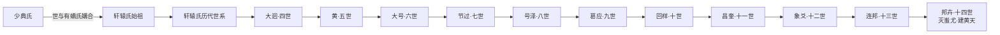

# 少典轩辕氏列
曰若稽古轩辕氏，本出少典氏也，世与有蟜氏媾合，妇宝生女于轩辕谷，成而为猷率民，名之曰"轩辕"。[1]

```mermaid
graph LR
    A[少典氏] -->|世与有蟜氏媾合| B[轩辕氏始祖]
    B --> C[轩辕氏历代世系]
    C --> D[大迥·四世]
    D --> E[黄·五世]
    E --> F[大号·六世]
    F --> G[节过·七世]
    G --> H[号泽·八世]
    H --> I[葛应·九世]
    I --> J[回样·十世]
    J --> K[昌奎·十一世]
    K --> L[象爻·十二世]
    L --> M[连邦·十三世]
    M --> N[邦卉·十四世<br>灭蚩尤·建黄天]
```

