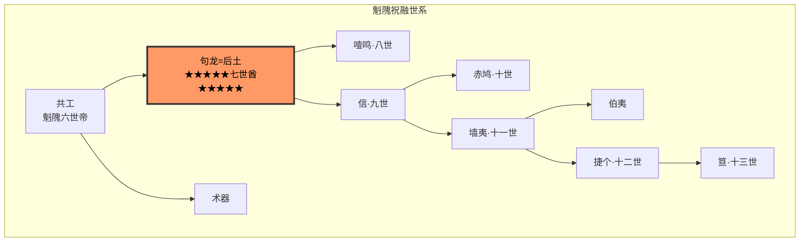

# 魁隗七世酋句龙祝融氏列
共工生术器与句龙。[1]

- **炎天上元二千九百九十八载于辛酉**：祝融氏酋共工薨，子姜句龙立。[2]
- **炎天上元三千有卌二载于乙巳**：酋薨，寿计六十有五。[3]

```mermaid
graph TD
    subgraph 魁隗祝融世系
        A[共工<br>魁隗六世帝] --> B[句龙=后土<br>★★★★★七世酋★★★★★]:::current
        A --> C[术器]
        B --> D[噎鸣·八世]
        B --> E[信·九世]
        E --> F[赤鸠·十世]
        E --> G[墙夷·十一世]
        G --> H[伯夷]
        G --> I[捷个·十二世]
        I --> J[笪·十三世]
    end
    classDef current fill:#f96,stroke:#333,stroke-width:3,color:#000
```
