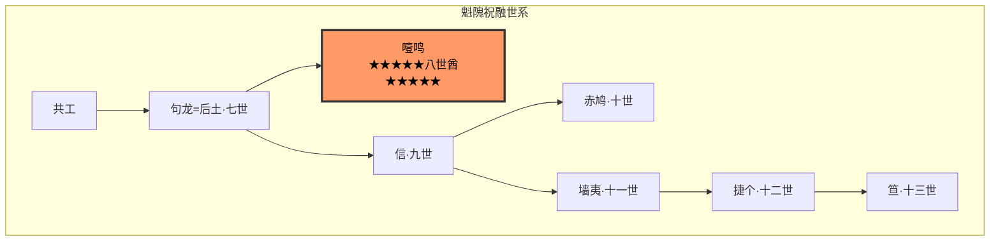

# 魁隗八世酋噎鸣祝融氏列
句龙生噎鸣与信。[1]

- **炎天上元三千有卌二载于乙巳**：祝融氏酋后土薨，子姜噎鸣立。[2]
- **炎天上元三千有六十二载于乙丑**：酋薨，寿计四十有二。[3]

```mermaid
graph TD
    subgraph 魁隗祝融世系
        A[共工] --> B[句龙=后土·七世]
        B --> C[噎鸣<br>★★★★★八世酋★★★★★]:::current
        B --> D[信·九世]
        D --> E[赤鸠·十世]
        D --> F[墙夷·十一世]
        F --> G[捷个·十二世]
        G --> H[笪·十三世]
    end
    classDef current fill:#f96,stroke:#333,stroke-width:3,color:#000
```
