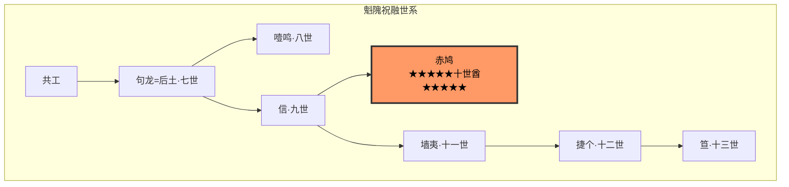

# 魁隗十世酋赤鸠祝融氏列
- **炎天上元三千有九十五载于戊戌**：祝融氏酋信薨，侄姜赤鸠立。[1]
- **炎天上元三千百卅五载于戊寅**：酋薨，寿计六十。[2]

```mermaid
graph TD
    subgraph 魁隗祝融世系
        A[共工] --> B[句龙=后土·七世]
        B --> C[噎鸣·八世]
        B --> D[信·九世]
        D --> E[赤鸠<br>★★★★★十世酋★★★★★]:::current
        D --> F[墙夷·十一世]
        F --> G[捷个·十二世]
        G --> H[笪·十三世]
    end
    classDef current fill:#f96,stroke:#333,stroke-width:3,color:#000
```

