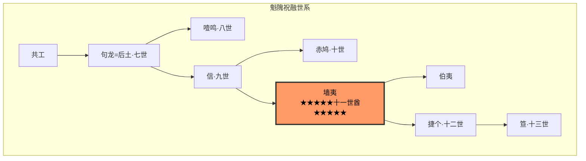

# 魁隗十一世酋墙夷祝融氏列
信生墙夷与后土。[1]

- **炎天上元三千百卅五载于戊寅**：祝融氏酋赤鸠薨，弟姜墙夷立。[2]
- **炎天上元三千百五十四载于丁酉**：酋薨，寿计卌三。[3]

```mermaid
graph TD
    subgraph 魁隗祝融世系
        A[共工] --> B[句龙=后土·七世]
        B --> C[噎鸣·八世]
        B --> D[信·九世]
        D --> E[赤鸠·十世]
        D --> F[墙夷<br>★★★★★十一世酋★★★★★]:::current
        F --> G[伯夷]
        F --> H[捷个·十二世]
        H --> I[笪·十三世]
    end
    classDef current fill:#f96,stroke:#333,stroke-width:3,color:#000
```

