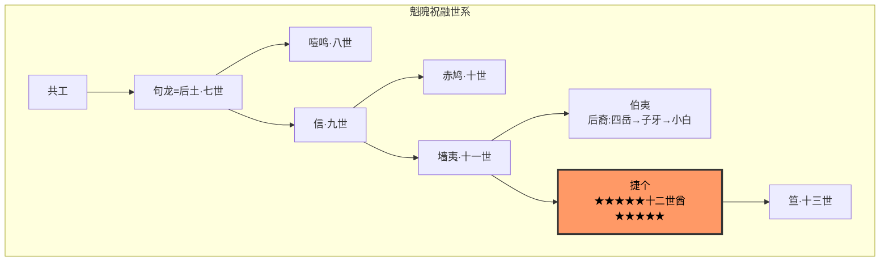

# 魁隗十二世酋捷个祝融氏列
墙夷生伯夷。[1]

- **炎天上元三千百五十四载于丁酉**：祝融氏酋墙夷薨，弟姜捷个立。[2]
- **炎天上元三千百六十三载于丙午**：炎帝来命伯夷司山祭。[3]
- **炎天上元三千百八十一载于甲子**：酋薨，寿计卌七。[4]

伯夷之后有四岳、子牙、子牙之后有小白。[5]

```mermaid
graph TD
    subgraph 魁隗祝融世系
        A[共工] --> B[句龙=后土·七世]
        B --> C[噎鸣·八世]
        B --> D[信·九世]
        D --> E[赤鸠·十世]
        D --> F[墙夷·十一世]
        F --> G[伯夷<br>后裔:四岳→子牙→小白]
        F --> H[捷个<br>★★★★★十二世酋★★★★★]:::current
        H --> I[笪·十三世]
    end
    classDef current fill:#f96,stroke:#333,stroke-width:3,color:#000
```

