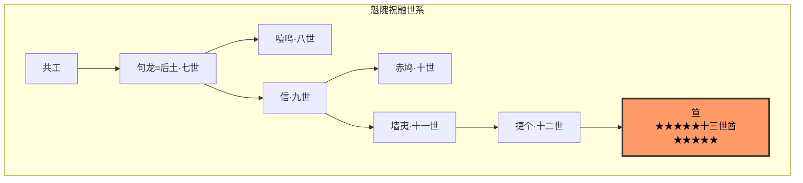

# 魁隗十三世酋笪祝融氏列
- **炎天上元三千百八十一载于甲子**：祝融氏酋捷个薨，弟姜笪立。[1]
- **炎天上元三千二百有三载于丙戌**：酋薨，寿计卌七，氏名大酋笪。[2]

```mermaid
graph TD
    subgraph 魁隗祝融世系
        A[共工] --> B[句龙=后土·七世]
        B --> C[噎鸣·八世]
        B --> D[信·九世]
        D --> E[赤鸠·十世]
        D --> F[墙夷·十一世]
        F --> G[捷个·十二世]
        G --> H[笪<br>★★★★★十三世酋★★★★★]:::current
    end
    classDef current fill:#f96,stroke:#333,stroke-width:3,color:#000
```

