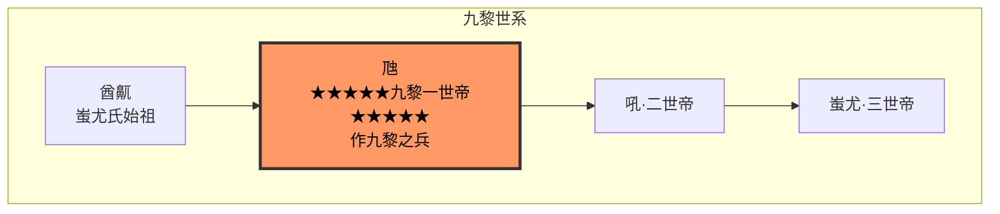

# 九黎一世帝虺九黎氏列
炎天上元三千百三十载，蚩尤氏生男于马灵之山，少有毅志，酋鼿冠名曰虺，命姓为姜，拙以为君领群，复以为猷率阵。[1]

- **玄天上元三千百五十五载于戊戌**：酋命营都于龙门，服诸野氏之民，成而自立为帝，号曰九黎玄天大帝。[2]
- **玄天上元三千百七十四载于丁巳**：九黎帝率氏东拓，至于于葛庐之山，得石若松绿，投火得金，凝则坚。帝感而作冶炼之术、凿石为范，皆戈矛斧戟矢之状，冶金成器，谓之为兵，九黎归服。九黎即服，帝列厥阵，名曰九黎之阵。[3]
- **玄天上元三千百八十二载于乙丑**：帝崩，葬马水之畔，寿计五十有三。帝作九黎之兵，天下惧之，祀名蚩尤帝虺。[4]

