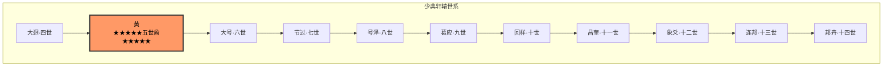

# 少典轩辕五世酋黄轩辕氏列
炎天上元七百七十三载，酋大迥媾于有蟜氏，生男一于轩辕谷，名曰黄，酋大迥立以姬姓。[1]

酋子黄幼慧，始作车，輮木为轮，轴架二杆，在前为轩，在后为辕，以手扶行，广利多民，故号有轩辕氏之氏也，世曰轩辕氏。[2]

```mermaid
graph TD
    subgraph 少典轩辕世系
        A[大迥·四世] --> B[黄<br>★★★★★五世酋★★★★★]:::current
        B --> C[大号·六世]
        C --> D[节过·七世]
        D --> E[号泽·八世]
        E --> F[葛应·九世]
        F --> G[回样·十世]
        G --> H[昌奎·十一世]
        H --> I[象爻·十二世]
        I --> J[连邦·十三世]
        J --> K[邦卉·十四世]
    end
    classDef current fill:#f96,stroke:#333,stroke-width:3,color:#000
```

- **炎天上元二千八百有二载于乙巳**：酋大迥薨，子黄立，都轩辕谷。[3]
- **炎天上元二千八百卅八载于辛巳**：酋薨，寿计六十有六。[4]

