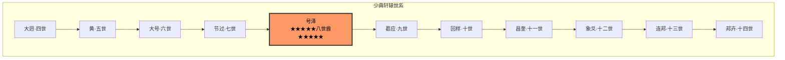

# 少典轩辕八世酋号泽轩辕氏列
炎天上元二千八百九十八载，轩辕氏生男一于雷原，酋节过子，名号泽，姬姓。[1]

- **炎天上元二千九百廿五载于戊申**：酋节过薨，子号泽立，都雷牙。[2]
- **炎天上元二千九百六十四载于丁亥**：酋薨，寿计六十有七。[3]

```mermaid
graph TD
    subgraph 少典轩辕世系
        A[大迥·四世] --> B[黄·五世]
        B --> C[大号·六世]
        C --> D[节过·七世]
        D --> E[号泽<br>★★★★★八世酋★★★★★]:::current
        E --> F[葛应·九世]
        F --> G[回样·十世]
        G --> H[昌奎·十一世]
        H --> I[象爻·十二世]
        I --> J[连邦·十三世]
        J --> K[邦卉·十四世]
    end
    classDef current fill:#f96,stroke:#333,stroke-width:3,color:#000
```

