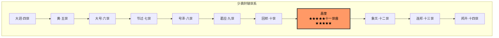

# 少典轩辕十一世酋昌奎轩辕氏列
炎天上元三千有十三载，轩辕氏生男一于丰涧，酋回样子，名昌奎，姬姓。[1]

- **炎天上元三千有卅二载于乙未**：酋回样薨，子昌奎立，都轩岗。[2]
- **炎天上元三千有七十五载于戊寅**：酋薨，寿计六十有三。[3]

```mermaid
graph TD
    subgraph 少典轩辕世系
        A[大迥·四世] --> B[黄·五世]
        B --> C[大号·六世]
        C --> D[节过·七世]
        D --> E[号泽·八世]
        E --> F[葛应·九世]
        F --> G[回样·十世]
        G --> H[昌奎<br>★★★★★十一世酋★★★★★]:::current
        H --> I[象爻·十二世]
        I --> J[连邦·十三世]
        J --> K[邦卉·十四世]
    end
    classDef current fill:#f96,stroke:#333,stroke-width:3,color:#000
```

