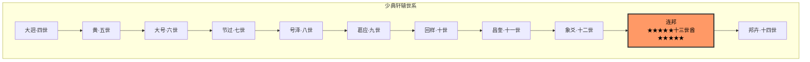

# 少典轩辕十三世酋连邦轩辕氏列
炎天上元三千百十载，轩辕氏生男一于万全之地，酋象爻子，名连邦，姬姓。[1]

- **炎天上元三千百廿九载于壬申**：酋象爻薨，子连邦立，都天门山。[2]
- **炎天上元三千百八十载于癸亥**：酋薨，寿计七十有一。[3]

```mermaid
graph TD
    subgraph 少典轩辕世系
        A[大迥·四世] --> B[黄·五世]
        B --> C[大号·六世]
        C --> D[节过·七世]
        D --> E[号泽·八世]
        E --> F[葛应·九世]
        F --> G[回样·十世]
        G --> H[昌奎·十一世]
        H --> I[象爻·十二世]
        I --> J[连邦<br>★★★★★十三世酋★★★★★]:::current
        J --> K[邦卉·十四世]
    end
    classDef current fill:#f96,stroke:#333,stroke-width:3,color:#000
```

